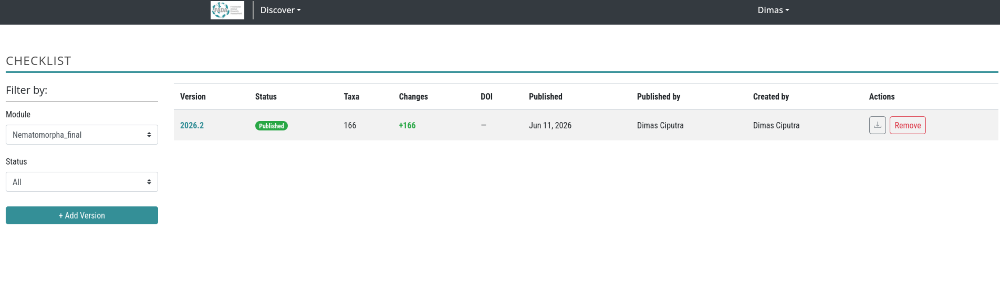
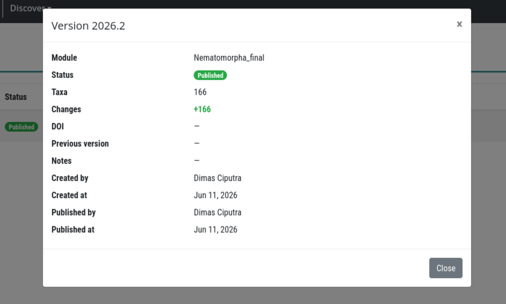
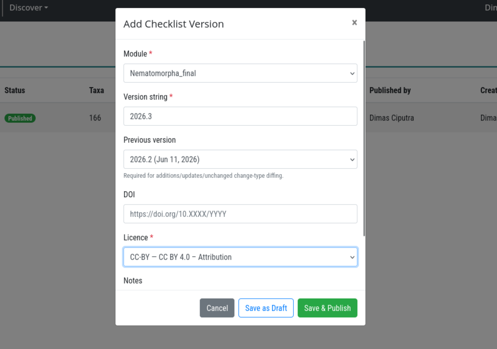
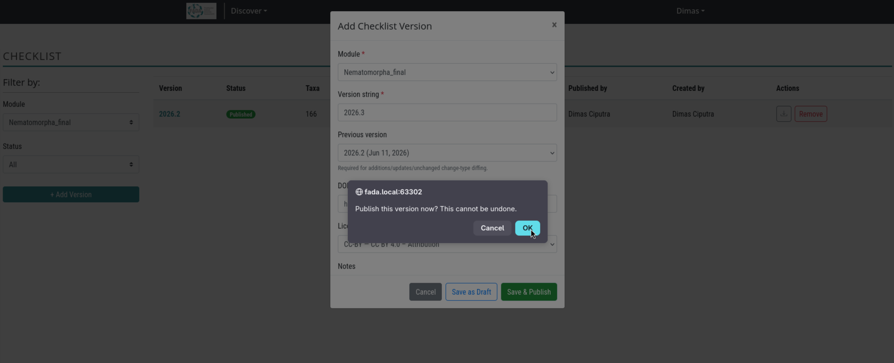
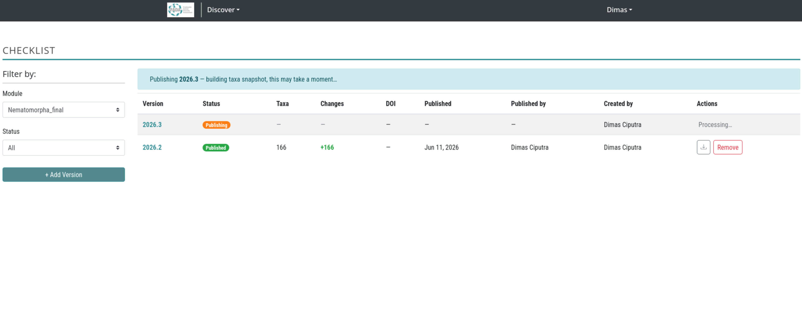

# Checklist Version Workflow

**Related standard:** [Catalogue of Life Data Package (ColDP)](https://github.com/CatalogueOfLife/coldp)

---

## Overview

BIMS publishes taxonomy as versioned, citable checklists — one release per biological module (TaxonGroup). Each published version is an immutable snapshot of all validated taxa in that module at the time of publishing. Changelog entries (additions, updates, deletions) are derived automatically by diffing the new snapshot against the previous version, so no manual tagging is required.

Published versions can be exported as a [ColDP ZIP](https://github.com/CatalogueOfLife/coldp) package for submission to [ChecklistBank](https://www.checklistbank.org) or for external citation.

---

## Prerequisites

| Role | Permissions |
|------|-------------|
| **Superuser** | Create draft versions, publish any version, remove any published version, view drafts |
| **Taxon group expert** | Publish and remove versions for modules they are assigned to, view drafts for those modules |
| **Authenticated user** | View published versions only |

To become a taxon group expert for a module, an admin must add you to that group's expert list via **Taxa Management** (`/taxa-management`).

---

## Accessing the Checklist Page

Navigate to `/checklist/` in your BIMS instance.



---

## Page Layout

The page is split into two areas:

**Left sidebar - Filters**
- **Module** dropdown - select the biological module (TaxonGroup) whose versions you want to view.
- **Status** dropdown (visible to publishers only) - filter between All, Published, and Draft.
- **+ Add Version** button (visible to superusers only).

**Main area - Version table**

| Column | Description |
|--------|-------------|
| Version | Human-readable version string, e.g. `2025.1`. Click to open version details. |
| Status | `Published` (green), `Draft` (grey), or `Publishing` (orange spinner) while the background task runs. |
| Taxa | Total validated taxa included in this published snapshot. Blank for drafts. |
| Changes | Changelog badges: `+N` additions (green), `-N` deletions (red), `~N` updates (blue). |
| DOI | The DOI assigned to this version, if any. |
| Published | Date the version was published. |
| Published by | User who triggered the publish action. |
| Created by | User who created the draft. |
| Actions | Download ColDP ZIP (published), Publish button (draft, for authorized users), Remove button (published, for authorized users). |

---

## Viewing Version Details

Click any version string in the table to open the version detail panel. It shows all metadata fields: module, status, taxa count, changelog summary, DOI, previous version UUID, internal notes, and audit timestamps.



---

## Creating a New Draft Version

Only superusers can create draft versions.

### Step 1 - Open the Add Version modal

Click the **+ Add Version** button in the left sidebar.

### Step 2 - Fill in the version form

| Field | Required | Description |
|-------|----------|-------------|
| Module | Yes | Pre-filled with the currently selected module. |
| Version string | Yes | Any string that is unique for this module, e.g. `2025.1`, `1.0`, `June-2025`. |
| Licence | Yes | The open licence to apply to this release (e.g. CC BY 4.0). |
| Previous version | No | The published version this release succeeds. Selecting one enables automatic changelog diffing. Leave blank for the first release of a module. |
| DOI | No | A DOI you have pre-reserved for this release. Can be added before or at publish time. |
| Notes | No | Internal release notes visible to editors only, not included in the ColDP export. |



### Step 3 - Save as draft or publish immediately

- **Save as draft** - the version is created with `Draft` status. You can publish it later from the table.
- **Save and publish** - the draft is created and immediately queued for publishing. You will be asked to confirm before proceeding.



---

## Publishing a Draft Version

Publishing can be triggered two ways:

1. **At creation** - click **Save and publish** in the Add Version modal.
2. **From the table** - click the **Publish** button on any existing draft row.

Both routes require you to confirm. After confirmation:

- The version status changes to `Publishing` (orange badge with spinner) immediately.
- A blue banner appears above the table: "Publishing `version` — building taxa snapshot, this may take a moment…"
- The page polls every 3 seconds and reloads the table automatically when publishing completes.



### What happens during publishing

1. All validated taxa belonging to the module and its child groups are collected.
2. Each taxon is diffed against the previous version's snapshot to determine its `change_type`.
3. A snapshot row is written for every taxon (one INSERT, never modified later).
4. Taxa count, additions count, updates count, and deletions count are recorded on the version.
5. The version status changes to `Published` and `published_at` is stamped.

---

## Understanding the Changelog

The **Changes** column shows how this version differs from its `previous_version`:

| Badge | Meaning |
|-------|---------|
| `+N` (green) | N taxa appear in this version that were absent from the previous snapshot. On the first release of a module all taxa are additions. |
| `-N` (red) | N taxa that existed in the previous snapshot are no longer present (e.g. removed from the module, de-validated). |
| `~N` (blue) | N taxa are present in both versions but at least one tracked field changed. |

A dash (`—`) means no previous version was set, or all counts are zero.

### Tracked fields for change detection

`scientific_name`, `rank`, `authorship`, `taxonomic_status`, `parent`, `basionym`, `kingdom`, `phylum`, `class`, `order`, `family`, `genus`, `vernacular_names`, `distributions`, `reference_id`.

---

## Downloading a ColDP ZIP

Click the download icon in the Actions column of any published version to export a ColDP ZIP package.

The ZIP contains:

| File | Contents |
|------|----------|
| `metadata.yaml` | Dataset title, version, DOI, licence, issued date |
| `NameUsage.tsv` | Full taxa list from the published snapshot |
| `VernacularName.tsv` | Common names |
| `Distribution.tsv` | Biogeographic distributions |
| `Reference.tsv` | Source references |

The export runs as a background task. When complete, a download dialog appears. Large modules may take a minute or two.

---

## Removing a Published Version

Authorized users (superuser or assigned taxon group expert) can remove a published version by clicking the **Remove** button in the Actions column and confirming.

Removal runs in the background and:
- Deletes all snapshot rows for that version.
- Clears `checklist_version_uuid` and `last_checklist_published_uuid` on affected `Taxonomy` rows.
- Deletes any associated ColDP ZIP download files.
- Deletes the `ChecklistVersion` record.

> **Warning:** Removal is permanent and cannot be undone.

---

## Version Chain

Each version points to its predecessor via `previous_version`, forming an auditable chain per module:

```
v2023.1 ──► v2024.1 ──► v2024.2 ──► v2025.1
  │              │            │
  │              │            └── 3 additions, 1 update
  │              └── 5 additions, 2 updates
  └── initial release (all taxa are additions)
```

Setting `previous_version = None` (first release) marks every taxon as an addition.

---

## Version UUIDs on Taxonomy Records

After publishing, BIMS stamps two version UUIDs on each `Taxonomy` record:

| Field | Set when |
|-------|---------|
| `checklist_version_uuid` | First publication in which this taxon appeared (`change_type = added`) |
| `last_checklist_published_uuid` | Every publication that included any change to this taxon |

These UUIDs appear in the Taxonomy REST API and in generated PDF headers:

```
Module:               Freshwater Invertebrates
Version:              2025.1
Version UUID:         a1b2c3d4-0000-0000-0000-000000000000
Previous version:     d4e5f6e7-0000-0000-0000-000000000000
DOI:                  https://doi.org/10.XXXX/YYYY
Changes this ver:     5 additions, 2 updates
Generated:            2025-04-01
```

---

## API Endpoints

| Method | Endpoint | Description |
|--------|----------|-------------|
| `GET` | `/api/checklist-version/` | List versions; filter by `taxon_group`, `status` |
| `POST` | `/api/checklist-version/` | Create a draft version (superusers only) |
| `GET` | `/api/checklist-version/<uuid>/` | Version detail |
| `POST` | `/api/checklist-version/<uuid>/publish/` | Publish a draft (superuser or taxon group expert) |
| `POST` | `/api/checklist-version/<uuid>/delete/` | Remove a published version (superuser or taxon group expert) |
| `POST` | `/api/checklist-version/<uuid>/export/` | Enqueue a ColDP ZIP export; returns `download_request_id` |
| `GET` | `/api/checklist-version/<uuid>/export/?download_request_id=<id>` | Stream the completed ZIP |

### List endpoint filters

| Parameter | Description |
|-----------|-------------|
| `taxon_group` | Filter by TaxonGroup ID |
| `status` | `published` (default for non-superusers) or `draft` |
| `page_size` | Results per page (max 100, default 20) |

---

## Per-Module Visibility (`checklist_enabled`)

Each `TaxonGroup` has a `checklist_enabled` boolean (default `False`). Only modules with `checklist_enabled = True` are listed in the public `/api/checklist-version/` endpoint and included in external ColDP feeds. The checklist management page itself uses the module category filter, so all taxon groups appear regardless of this flag.

---

## Troubleshooting

**Publish button is not visible on a draft row**
You are not a superuser and are not listed as an expert for that taxon group. Ask an admin to grant you expert access via Taxa Management.

**Status stays "Publishing" for a long time**
The Celery background worker may be overloaded or stopped. Contact your system administrator to check the worker queue. The `is_publishing` flag will remain set until the task completes or fails. If the task fails, the flag is automatically cleared so the Publish button reappears.

**Changes column shows a dash for a published version**
Either `previous_version` was not set (all taxa are additions but the `+N` count equals the total so no special formatting is needed) or all counts are zero. Check the version detail panel for the raw counts.

**ColDP ZIP download never completes**
The export task runs via Celery. If the download dialog stays open indefinitely, contact your system administrator to check the worker. You can close and re-click the download icon to reuse the same in-progress download request.

**"Version already exists for this module" error**
The version string you entered is already in use for this module. Choose a different string, e.g. increment the minor version or append a suffix.
