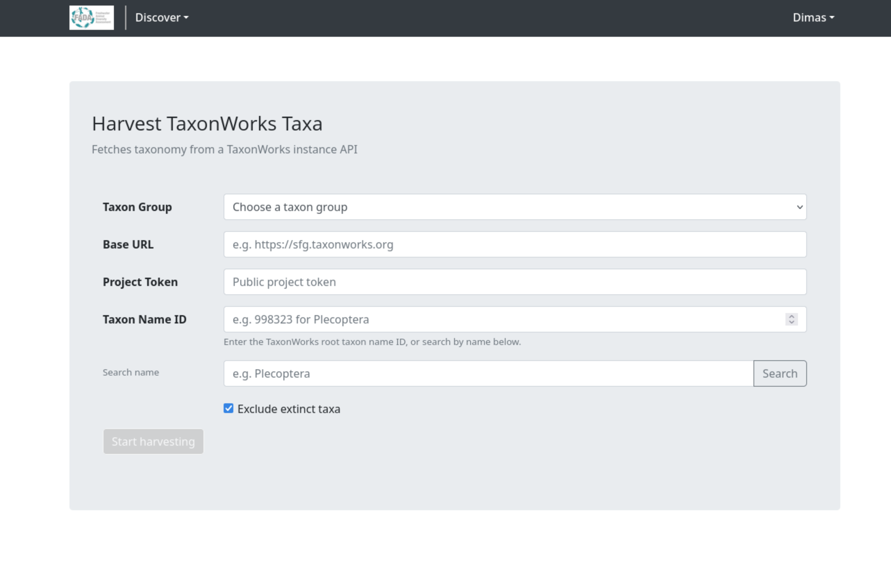
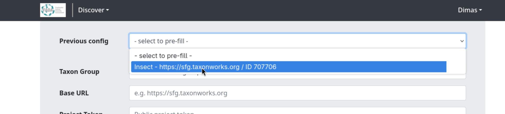
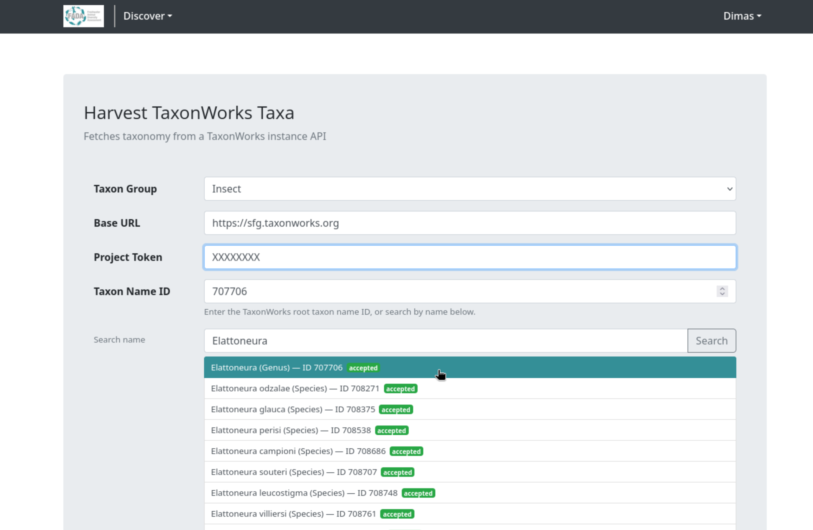
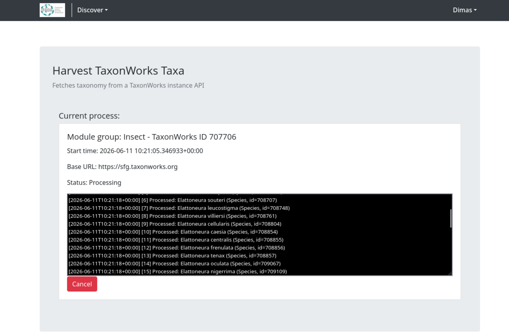
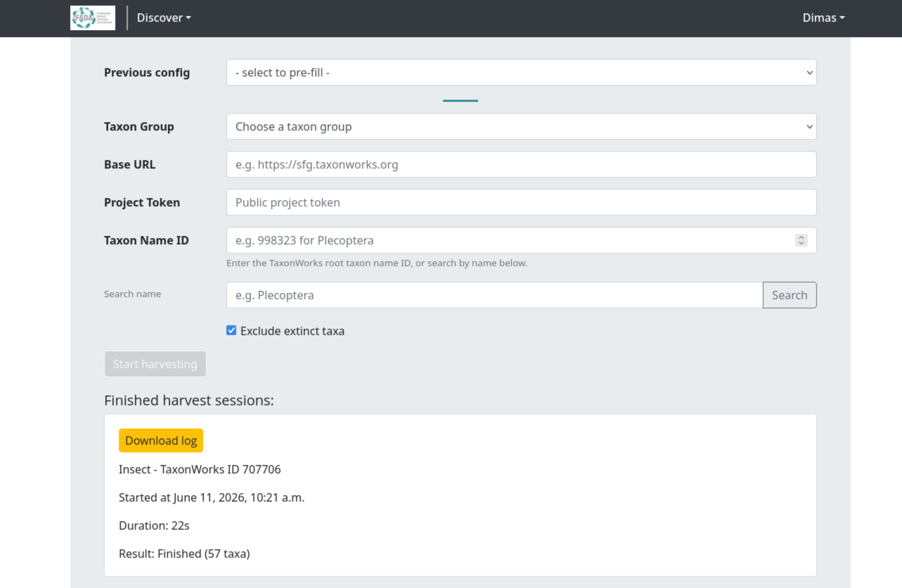

# Harvest External Taxonomy from TaxonWorks

## Overview

Import taxonomy from a [TaxonWorks](https://taxonworks.org) instance into BIMS by providing the instance URL, a project token, and a root taxon ID. The harvester fetches all taxa in the project and recursively imports the subtree beneath the chosen root.

---

## Prerequisites

- This page is only available to admin users.
- You need the following from your TaxonWorks project:
    - **Base URL** of the TaxonWorks instance (e.g., `https://sfg.taxonworks.org`)
    - **Project Token** - the public API token for your project
    - **Taxon Name ID** of the root taxon to harvest from (use the search helper on the page if you do not know it)

---

## Accessing the Harvest Page

Navigate to `/harvest-taxonworks/` in your BIMS instance.

---

## Starting a Harvest Session

### Step 1 - Load a Previous Configuration (Optional)

If you have run a harvest before, a **Previous config** dropdown appears at the top of the form. Selecting an entry pre-fills all fields with the settings from that prior run.

### Step 2 - Select a Taxon Group

Choose the taxon group to which the harvested taxa will be linked. 

If the group you need does not exist yet, create it first via **Taxa Management** (`/taxa-management`).

### Step 3 - Enter the TaxonWorks Connection Details

Fill in the three required fields:

| Field | Description | Example |
|---|---|---|
| Base URL | Full URL of the TaxonWorks instance | `https://sfg.taxonworks.org` |
| Project Token | Public API token for the project | `abc123xyz` |
| Taxon Name ID | Numeric ID of the root taxon to harvest | `998323` |

To find the Taxon Name ID, use the **Search name** helper below the field: enter a taxon name, click **Search**, and click the matching result to fill the ID automatically. The search requires Base URL and Project Token to be filled first.

### Step 4 - Set Options

**Exclude extinct taxa** (checked by default) - taxa marked with the dagger symbol (†) in TaxonWorks are skipped along with their descendants.

### Step 5 - Start the Harvest

Once all required fields are filled, the **Start harvesting** button becomes active. Click it to submit.

The page reloads and shows the active session panel with the module group, start time, base URL, a live status line, and a scrolling log output.

---

## Monitoring Progress

The page polls for updates every second. The status line shows how many taxa have been processed (e.g., "[15] Processed...").

---

## Canceling a Session

Click the red **Cancel** button to stop an in-progress harvest. Confirm in the dialog that appears.

The taxa already processed before cancellation are kept in the database.

---

## Finished Sessions

Completed and canceled sessions appear in the **Finished harvest sessions** section. Each card shows:

- Taxon group name and TaxonWorks ID
- Start time and duration
- Result status (or "Canceled" in red)
- A **Download log** button for the full log file

---

## What the Harvester Imports

For each taxon fetched from TaxonWorks, the following data is stored:

| Data | Source |
|---|---|
| Scientific name | `cached` and `name_string` fields |
| Taxonomic rank | `rank` field, inferred if missing |
| Taxonomic status | Accepted or synonym, from `cached_is_valid` |
| Author | `cached_author_year` field |
| Parent chain | Full lineage built from TaxonWorks hierarchy |
| TaxonWorks metadata | Stored in `additional_data` (source, project ID, record timestamps, taxon name ID) |
| GBIF lineage | Looked up from GBIF if the parent chain is incomplete |

Extinct taxa (those with † in TaxonWorks) are skipped when **Exclude extinct taxa** is checked.

---

## Troubleshooting

**"Start harvesting" button stays disabled**
All four fields (Taxon Group, Base URL, Project Token, Taxon Name ID) must be filled before the button enables.

**Name search returns "Search failed"**
Check that the Base URL and Project Token are correct and that the TaxonWorks instance is reachable.

**Session appears stuck / no log updates**
Contact your system administrator to check the background task workers. Cancel the session and try again once the issue is resolved.

**Harvest finishes immediately with very few taxa**
The Taxon Name ID may not have any children in the project, or it may refer to a taxon outside the project's scope. Use the name search helper to verify the ID is correct.
