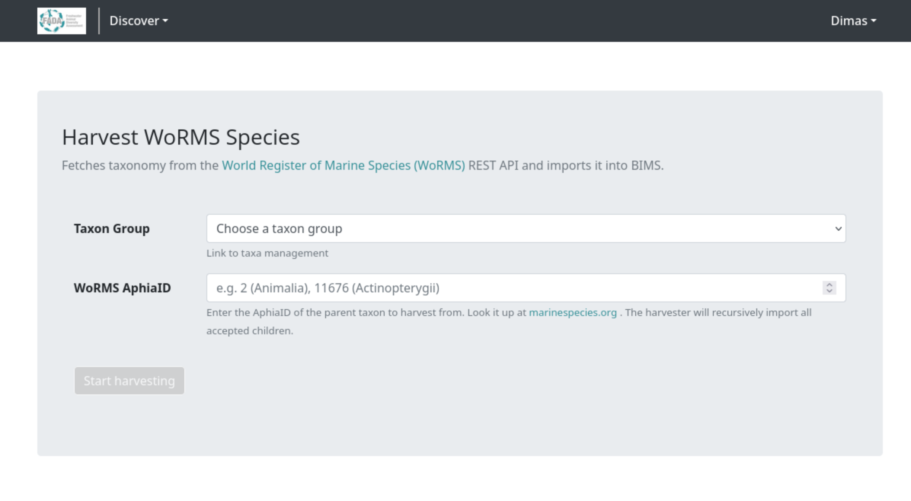
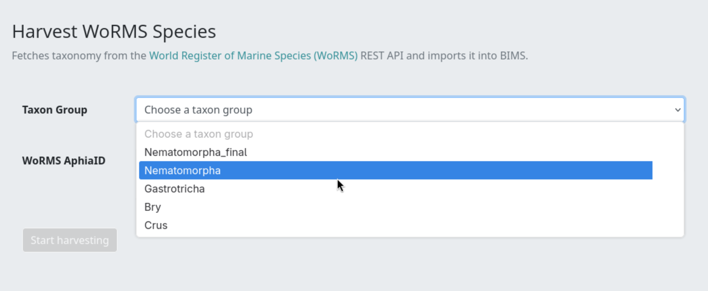
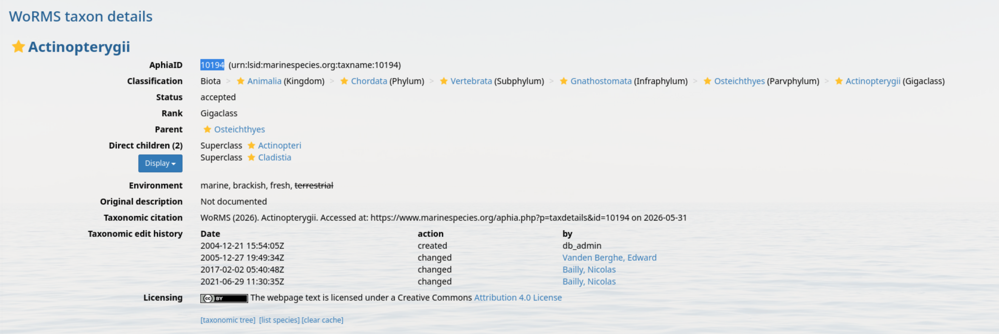
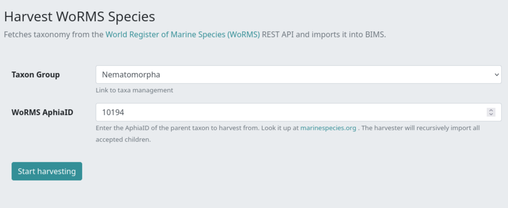
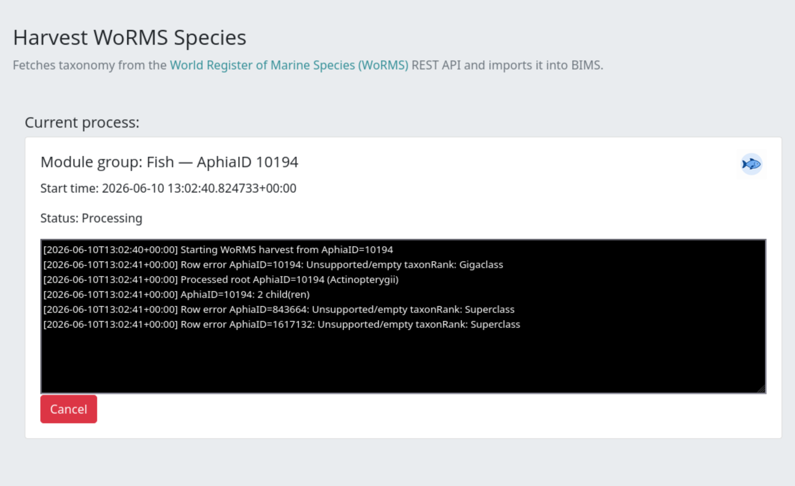
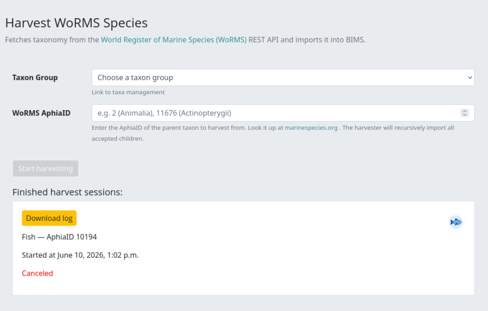
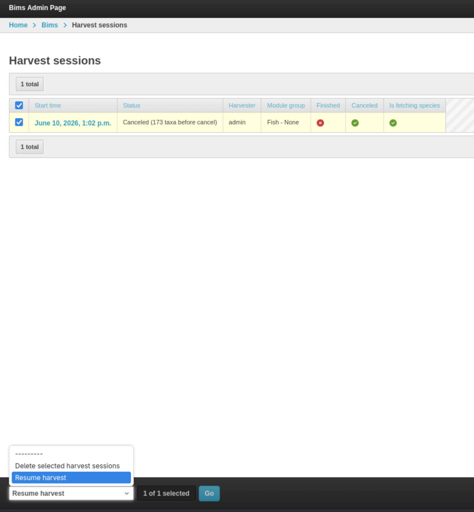

# Harvest External Taxonomy from WoRMS

## Overview

Import taxonomy from [WoRMS](https://www.marinespecies.org) into BIMS by providing a parent AphiaID. The harvester recursively imports all accepted child taxa and links them to a taxon group.

---

## Prerequisites

- This page is only available to admin users.
- You need the **AphiaID** of the parent taxon you want to harvest. Look it up at [marinespecies.org/aphia.php?p=search](https://www.marinespecies.org/aphia.php?p=search).

---

## Accessing the Harvest Page

Navigate to `/harvest-worms/` in your BIMS instance.

---

## Starting a Harvest Session

### Step 1 - Select a Taxon Group

Choose the taxon group you want the harvested taxa to belong to from the **Taxon Group** dropdown.

If the group you need does not exist yet, create it first via **Taxa Management** (`/taxa-management`).

### Step 2 - Enter the WoRMS AphiaID

Enter the numeric **WoRMS AphiaID** of the parent taxon you want to harvest from. The harvester will recursively import all accepted child taxa beneath it.

Common starting points:

| Taxon | AphiaID |
|---|---|
| Animalia (all animals) | 2 |
| Actinopterygii (ray-finned fish) | 11676 |

To look up an AphiaID, search on [marinespecies.org](https://www.marinespecies.org/aphia.php?p=search) and copy the ID from the taxon's detail page.

### Step 3 - Start the Harvest

Once both fields are filled, the **Start harvesting** button becomes active. Click it to submit the form.

The page will reload and display the active session panel showing:

- Module group name and AphiaID
- Start time
- Live status text
- A scrolling log output (last 50 lines)
- A **Cancel** button

---

## Monitoring Progress

The page polls the API endpoint `/api/harvest-status/<session_id>/` every second and updates the status text and log automatically. You do not need to refresh the page manually.

The log shows each taxon as it is processed, any errors encountered, and a summary when the session finishes. When the harvest completes, the page reloads and the session moves to the **Finished harvest sessions** list.

---

## Canceling a Session

To stop an in-progress harvest, click the red **Cancel** button. A confirmation modal appears. Click **Cancel session** to confirm.

The session is marked as canceled. It will appear in the finished sessions list with a red "Canceled" label.

---

## Finished Sessions

After a session completes (or is canceled) it appears in the **Finished harvest sessions** section below the form. Each card shows:

- Taxon group name and AphiaID
- Start time
- Result status (or "Canceled" in red)
- A **Download log** button to retrieve the full log file

- 

---

## What the Harvester Imports

For each taxon fetched from WoRMS, the following data is stored:

| Data | Description |
|---|---|
| Scientific name | Canonical and full scientific name with authority |
| AphiaID | Stored on the `Taxonomy.aphia_id` field |
| Taxonomic rank | Kingdom down to subspecies |
| Taxonomic status | Accepted, synonym, or other |
| Parent chain | Full lineage built automatically |
| Habitat tags | Marine, Brackish, Fresh, or Terrestrial flags |
| Citation / source | WoRMS citation stored as a source reference |
| GBIF key | Looked up from GBIF after import if not already present |

Synonyms are linked to their accepted taxon but are not harvested as separate tree nodes by default.

---

## Resuming an Interrupted Session (Admin)

If a harvest session is interrupted (e.g., worker restart), an admin can resume it from the Django admin panel:

1. Go to **Admin > Harvest Sessions**.
2. Select the interrupted session.
3. Use the **Resume harvest** action.

The task picks up from the last processed AphiaID.

---

## Troubleshooting

**"Start harvesting" button stays disabled**
Both the Taxon Group and a valid AphiaID (a positive integer) must be selected before the button enables.

**Harvest finishes immediately with no taxa imported**
The AphiaID may not have any accepted children in WoRMS, or the AphiaID itself may be invalid. Verify it on [marinespecies.org](https://www.marinespecies.org).

**Session appears stuck / no log updates**
Contact your system administrator to check the background task workers. You can cancel the session and try again once the issue is resolved.

**Permission denied / redirect to login**
This page is restricted to admin users. Contact your site administrator to request access.
