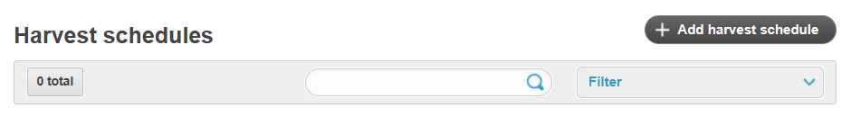
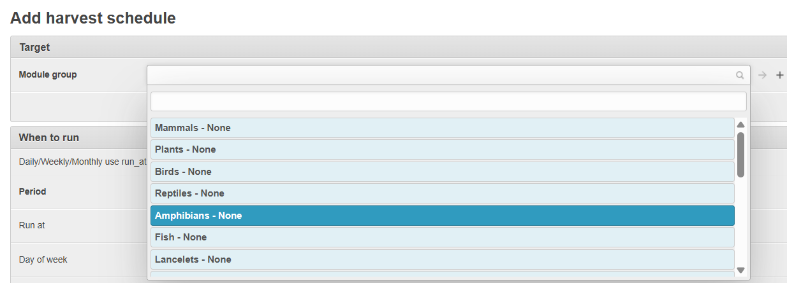
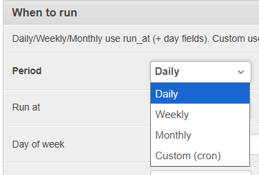
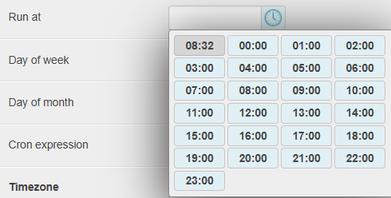

# Harvesting GBIF data

All existing taxon occurrence data are harvested per Taxon Group from the Global Biodiversity Information Facility (GBIF). This section outlines the steps for harvesting GBIF data.

Only registered users with **super user status** are able to do this, typically the administrators .

The Master List of Taxa for a Taxon Group is used to facilitate harvesting of data from GBIF, thereby ensuring that the correct taxa are included on the information system.

## Steps

Click on your profile and select **Harvest from GBIF**.

Select the Taxon Group using the dropdown and click Start harvesting.

You can keep track of progress. The more taxa in the master list, the longer the time needed for harvesting data from GBIF. You can keep it running in the background and continue with other work as it harvests the data.

You can view the GBIF data harvested via the **Download Logs**.

# Setting up GBIF harvest schedules

There is also functionality for users to set up harvesting schedules to download occurrences and species from GBIF automatically in the backend. 

To set up a harvesting schedule, visit the Admin page > BIMS > Harvest schedules

Click '+ Add harvest schedule'

Choose the biodiversity module or group from the dropdowns available.

Set the period:

- Weekly: specify the day(s) of the week. You can also use values like mon, tues or 0-6 (where 0 = Sunday).
- Monthly: specify the date (eg., 15 for the 15th)
- Custom (cron): enter a cron expression. This option is mainly for developers, but it allows more flexibility (e.g., hourly, every 30 mins)

Add the run time. The task will be triggered at this hour (UTC timezone).

Configure the defaults from the job section (these are for the harvest session settings).

Set the boundary.

Check 'Is fetching species' if you want to harvest species.

**Note:**
- Only 3 harvest sessions can run at a time per BIMS instance.
- If you want to harvest species, make sure the GBIF parent species is added to the module group, just like when a user harvests species.
