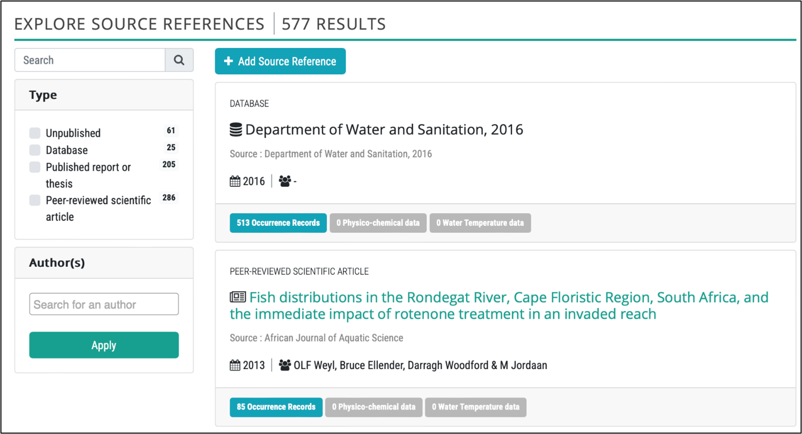
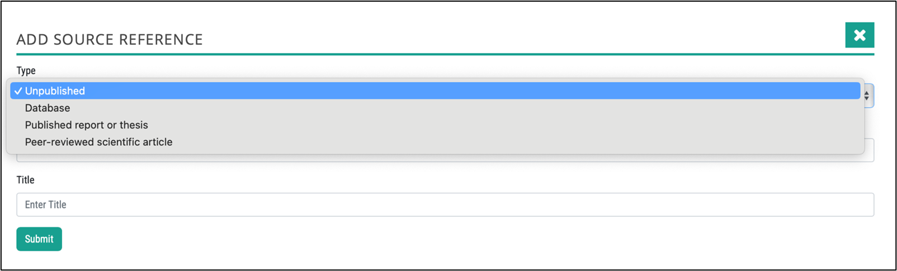
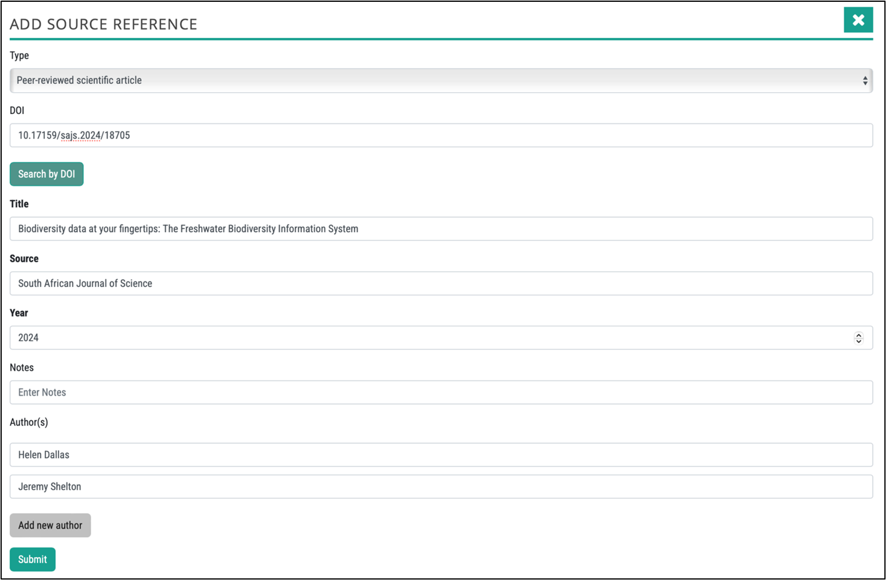
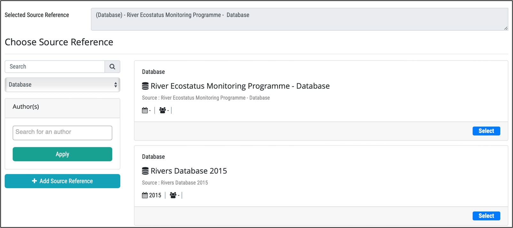
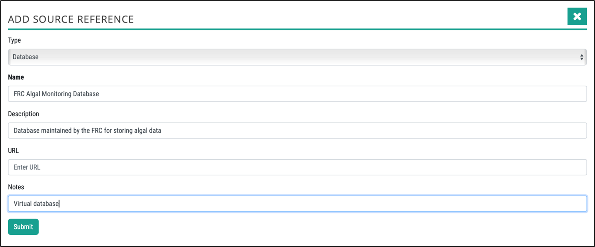
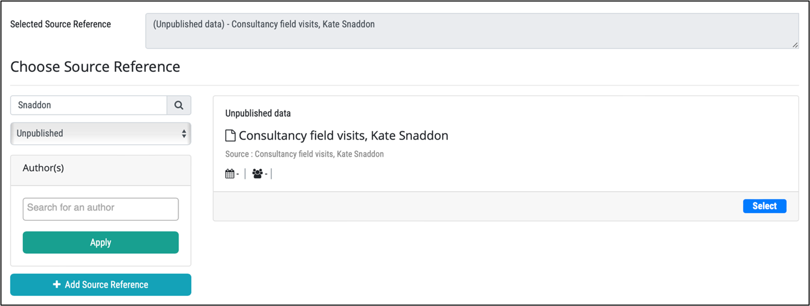
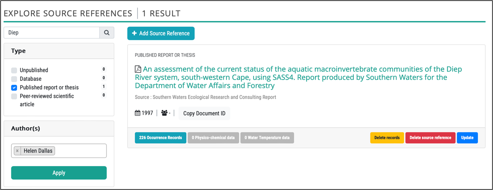

# Managing Source references

A specific administration module has been developed to allow administrators to manage metadata and citations associated with each biological occurrence record, as well as physico-chemical and water temperature data.

All **users** can access Source References via **Data – Source References**. Users are able to use the search and filter functionality to find specific source references. Users are not able to edit source references, other than the one(s) they have added. The number of occurrence records, physico-chemical data and water temperature data are visible for each source reference.

Users are also able to upload pdf reports prior to uploading occurrence data, so that the source reference is available when data are added using the forms (see section below on **[Adding a source reference using data capture forms](#adding-a-source-reference-using-data-capture-forms))**.

**Administrators** are able to edit all source references, delete records associated with a source reference, and delete a source reference. This may be necessary if incorrect occurrence data are uploaded to the platform, although this is not common. **NB. Never delete a Source Reference without first deleting the Records.**

All biodiversity data served need to have associated Metadata, which is visible in the metadata table in the dashboards. This metadata allows the users to establish exactly where the data originated from and to navigate to the study reference if desired.

## Types of source references

Multiple sources of taxon occurrence data generally exist, although this is highly dependent on the country. Potential sources of biodiversity data include the following source reference categories:

* Peer-reviewed scientific articles
* Theses
* Published reports
* Databases
* Unpublished data

The following sections provide details of the recommended processes for sourcing taxon occurrence data from the different reference categories. This is done by all users adding data and by administrators.

### Peer-reviewed scientific article

Data from peer-reviewed scientific articles are best sourced by undertaking a literature search using Google Scholar. To ensure that relevant papers are identified, appropriate search term combination should be used. For example, for all native freshwater fishes in South Africa: “Genus species” & “South Africa” (where “Genus species” represents the scientific name for each taxon).  It is important that search terms are clearly-defined and consistent, so that the process is repeatable and defensible.

### Thesis

University theses are easily searched using relevant university search engines. Often local experts also know of relevant theses and can be contacted directly. Where possible, electronic data should be sourced directly from individuals, as this saves significant time that would otherwise be occupied in transcription of paper to digital records during data consolidation.

### Published report

Technical and consultancy reports are often difficult to source and requires knowledge of local experts who have undertaken relevant studies. Where possible, electronic data should be sourced directly from individuals, as this saves significant time during data consolidation.

### Database

Identify and contact relevant organisations who may have data to share that is already in a database. Data sharing agreements may be needed depending on the organisation. For organisation that regularly add data it is useful to set up a database in the organisation’s name.

### Unpublished data

Identify individuals who may have data to share. Where possible, electronic data should be sourced directly from individuals, as this saves significant time during data consolidation.

Source reference system can store either an electronic document (e.g. by attaching a PDF to the document record) or a link to an online resource (URL). The order of preference should be:

1. Use DOI based citations wherever possible (in which case the URL attribute described below should not be needed).
2. Use documents with references to external resources (i.e. a URL that points to a published PDF on a web site).
3. Used documents with attached PDF as a last resort (this will require first uploading the document in the document management system and then providing the link to the uploaded document  in the metadata table described below).

## Adding source references to occurrence data

Source references are either added when data are added using the data capture forms (users and administrators), or when uploading occurrence data (administrators or trained data providers) using the data upload excel file. (See **[Preparing and checking an Occurrence Data File before uploading](https://kartoza.github.io/bims-website/administrator/biodiversity-data/occurrence-data-preparation/)**).

### Adding a source reference using data capture forms

When adding data, two data capture forms are shown in sequence, namely 1) an occurrence record form, where you capture which taxa were present and the source reference; 2) an abiotic data form where you capture physico-chemical and other abiotic data.

The correct source reference can be searched for by reference type, name or author if it already exists or it can be added by clicking “**Add Source Reference**” and selecting the type. See details for each in the sections below.

### Peer-reviewed scientific articles

If the article already exists, select Peer-reviewed scientific article as the reference type, and insert the author and click Apply.  Then select the correct source reference.

To add a new Peer-reviewed scientific article, click **+ Add Source Reference**. Then select the reference category type and insert the DOI and click the **search by DOI** button. The citation is then retrieved via an online citation management system and inserted. Click Submit to save.

### Published reports and theses

If the book, report or thesis already exists, select Published book, report or thesis as the reference type, and insert the author and click Apply.  Then select the correct source reference. 

To add a new Published book, report or thesis, click **+ Add Source Reference**, select the reference type and add the relevant details as shown below.

### Databases

If the database already exists, select Database as the reference type, and insert text in the Search filter to retrieve the relevant database.  Then select the correct source reference. 

To add a new Database, click **+ Add Source Reference**, select the reference type and add the relevant details as shown below.

### Unpublished data

If the Unpublished dataset already exists, select Unpublished as the reference type, and insert text in the Search filter to retrieve the relevant unpublished dataset.  Then select the correct source reference. 

To add a new Unpublished dataset, click **+ Add Source Reference**, select the reference type and add the relevant details as shown below.

## Administrators: Adding a source reference using occurrence upload excel files

Where data are uploaded using the Data Upload Templates, the data capturer needs to specify the following:

* **Author(s)**: Surname + Initials
* **Year**: Year of study
* **Source**: Details such as journal name, report, thesis, database and unpublished data.
* **Title**: Title of the report. thesis, database or unpublished dataset.
* **Reference category**: Select from dropdown options
* **URL**: Thesis handle, or article link if no DOI available
* **DOI**: DOI for reference ( e.g. 10.2989/16085914.2018.1491385) – the citation for articles with DOIs is done automatically.
* **Document Upload Link**: Link to "Source Reference" page after uploading PDF or URL of published report or thesis.

Since metadata are compulsory, the occurrence data will not upload unless either a DOI, URL or Document Upload Link is included.

### Using Source References as an administrator

Errors can arise when source references are added to the information system by users. These can be picked up and fixed by undertaking various filters, checking and edits, including those listed below.

* Search for a reference type or category

 

* Search by author(s)
 
 
 
* Search using free text
 
 

Once the source reference has been found, it can be updated or deleted (only if there are not records associated with it), and the Document ID can be copied. This is needed when uploading occurrence records using the excel template.

By clicking on the records button you can check exactly which sites and data are linked to the source reference.

