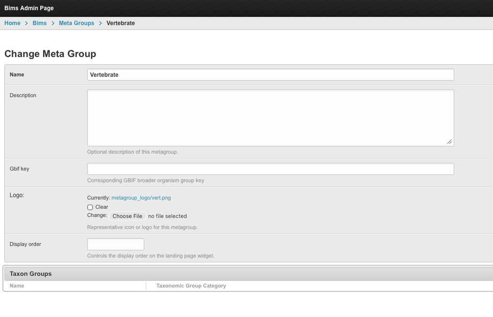
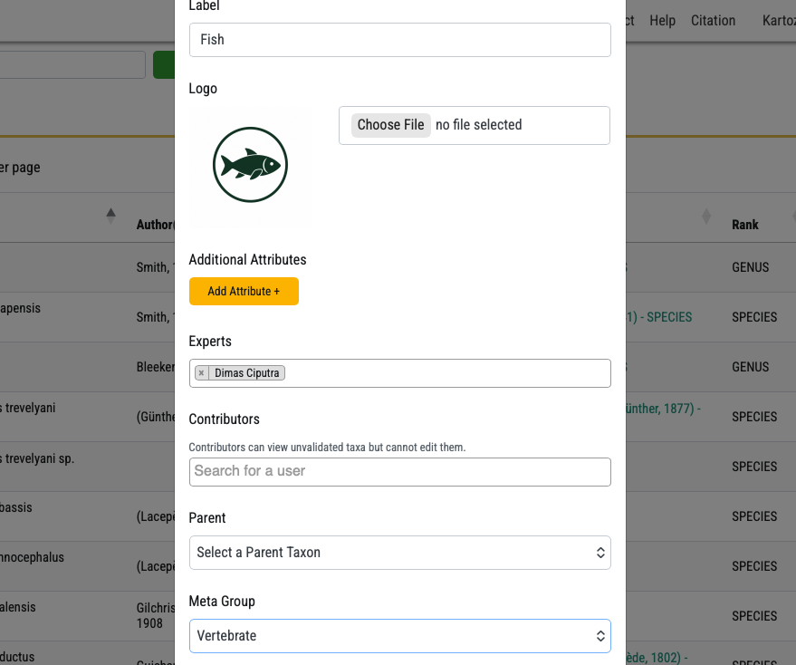
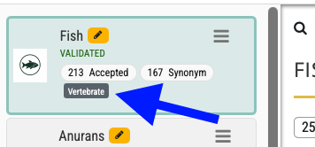
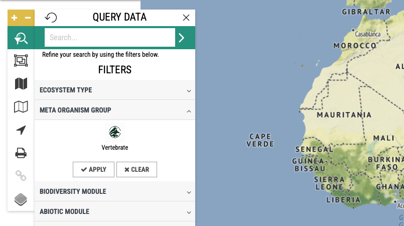

# Meta Groups Admin Guide

This guide explains how Meta Groups work in BIMS, how an administrator can add them, and where users will see them.

Meta Groups are broad organism groups used to group related Taxon Groups together. For example, a site may have several Taxon Groups such as Fish, Amphibians, and Reptiles. A Meta Group can be used to organise these under a broader label, such as Vertebrates.

## Where Meta Groups Fit

BIMS uses three levels:

- **Species or taxon records** are the individual taxa and occurrence records.
- **Taxon Groups** are the biodiversity modules, such as Fish or Plants.
- **Meta Groups** are broader organism groups that can contain one or more Taxon Groups.

In short:

`Taxa and records -> Taxon Group -> Meta Group`

## Adding A Meta Group

1. Open the admin area.
2. Go to **BIMS -> Meta Groups**.
3. Select **Add Meta Group**.
4. Complete the main fields:
   - **Name**: the public name users will see, such as Vertebrates.
   - **Description**: optional supporting text.
   - **GBIF key**: optional. Use only if your team tracks the related GBIF group.
   - **Logo**: optional image used in cards and filter icons.
   - **Display order**: optional number used to control ordering. Lower numbers appear first.
5. Save the Meta Group.

## Assigning Taxon Groups To A Meta Group

After creating a Meta Group, assign one or more Taxon Groups to it.

You can do this from either place:

- Open the Meta Group in admin and use the Taxon Group section on the same page.
- Open **BIMS -> Taxon Groups**, edit the Taxon Group, and select the Meta Group field.

Only assign a Taxon Group to one Meta Group at a time. If a Taxon Group does not have a Meta Group, it will still work normally, but it will not appear under any Meta Group filter.

## How It Shows In Taxon Groups

Once assigned, the Meta Group name appears with the Taxon Group in admin and taxonomy management areas.

Administrators can use this to quickly check whether modules are grouped correctly. For example, the Fish Taxon Group may show a Meta Group label such as Vertebrates.

If the label is missing, check that the Taxon Group has been saved with a Meta Group selected.

## How It Shows On The Map View

On the map search panel, Meta Groups appear in the **META ORGANISM GROUP** filter section.

Each Meta Group is shown as an item with its name. If a logo was uploaded, the logo is used as the icon. If no logo was uploaded, a default placeholder icon is shown.

The section only appears when at least one Meta Group exists.

## How The Map Filter Works

Users can select one or more Meta Groups in the map filter.

When a Meta Group is selected:

- The map results are limited to records from Taxon Groups linked to that Meta Group.
- The filter includes all Taxon Groups inside the selected Meta Group.
- Selecting more than one Meta Group shows records from all selected Meta Groups.

Example:

If Vertebrates contains Fish and Amphibians, selecting Vertebrates will show records from both Fish and Amphibians.

## Troubleshooting

**The Meta Group does not appear on the map.**

Check that at least one Meta Group exists and that it has Taxon Groups linked to it. Refresh the page after saving.

**A Taxon Group is not included when filtering by Meta Group.**

Open the Taxon Group and confirm that the correct Meta Group is selected.

**The icon is missing.**

Upload a logo on the Meta Group. If no logo is uploaded, the system shows a simple placeholder icon.

**The landing page does not show Meta Groups.**

Check the site setting for showing Meta Groups on the landing page. The map filter can still work even when the landing page section is disabled.
