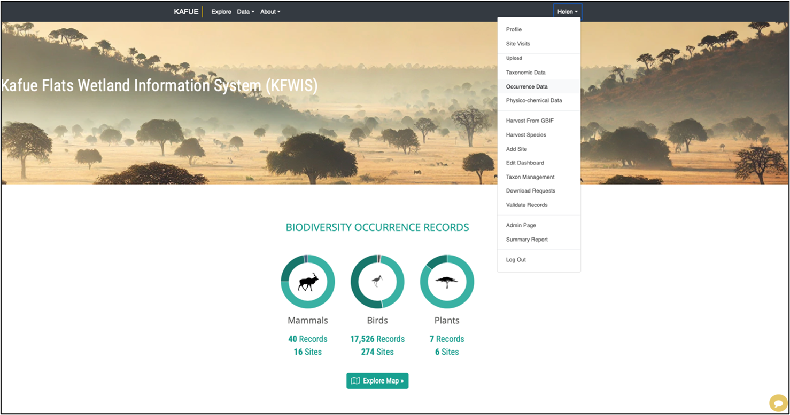
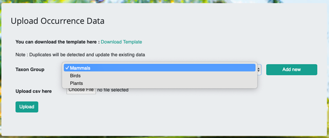

# Uploading Occurrence Data

## Steps:

Click on your profile and select **Upload Occurrence Data**

Select the Taxon Group using the dropdown and browse to the file containing the occurrence data for the taxon group, click upload

Progress is shown:

A **Success** file will indicate occurrence records uploaded to the system. An **Error** file will give details of occurrence records not uploaded. The last column in this csv file provides an indication of the reason the occurrence record was not uploaded. The administrator then needs to check the data and correct before uploading again.

**Common errors:**

* Taxon not in Master list
* Taxon Rank incorrect

Occurrence records may be updated by uploaded corrected records in the csv file. As long as the UUID is the same then the old occurrence record will be updated.

New occurrence records may be added by repeating the steps from (4), to upload the additional occurrence records for the Taxon Group.

Note that once the occurrence data has been uploaded, geocontext data (i.e. information about the site such as province, catchment etc.) are automatically populated for each site. This takes time and it is recommended that the next step (i.e. harvesting from GBIF), is done at least 24 hours after uploading occurrence data.
