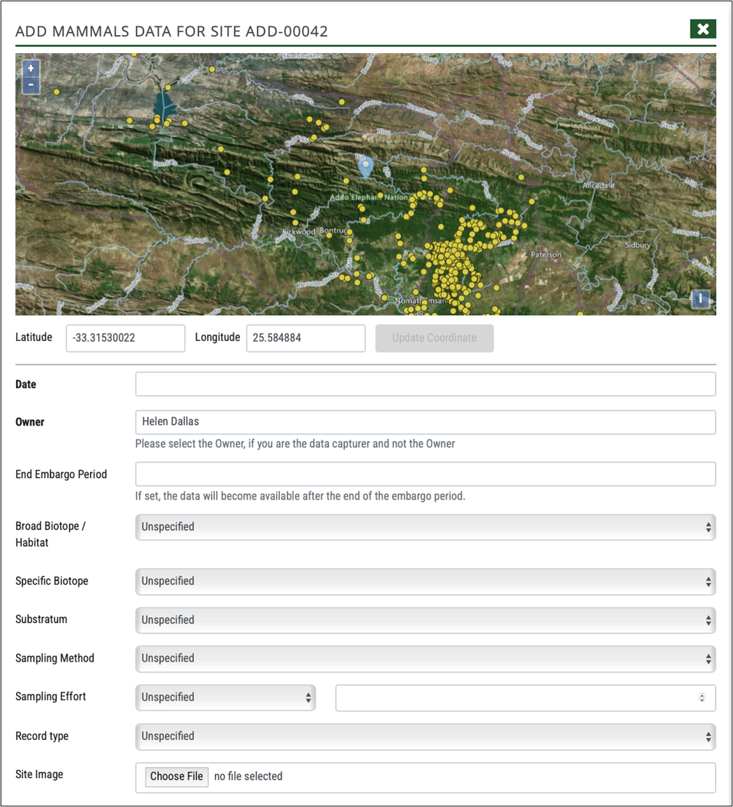

# Adding a site and biodiversity occurrence records at a site

This section explains how an administrator or user adds a site and data to a site.

## Adding a site

An administrator or user can add a new site using the **Add Site** button on the menu bar.

This opens the Add a Location Site form:

Different tenants on BIMS have slightly different options for adding a site and the site code generated varies amongst tenants, and may use Park Name, River Name, Wetland Name etc.

The user adds the latitude and longitude by inserting the co-ordinates or clicking on correct location on the map, click Generate Site Code. This is automated.

A user site code can also be added, as well as a description of the site. The owner is specified using the dropdown if the logged in user is not the owner. Site images can be added. Lastly, the user agrees to these data being shared via the platform for visualisation and download by registered users, and click Add. The new site is thus created.

For FBIS, the user needs to select if the site is a River, Wetland or Open Waterbody site. Depending on the selection, additional fields such as Geomorphological Zone or Hydrogeomorphic Type are captured. For Rivers site the user has the ability to select a User Geomorphological Zone, based on ground-truthed data, which is particularly important for the interpretation of SASS data that relies on these zones for derivation of ecological category.

## Adding new biodiversity records

New occurrence data can be added from both the site form and by using the **+ Add** on the side panel.

Clicking Add on either, opens the data capture form for a specific biodiversity module. The administrator or user needs to add the Date, specify the owner, and select the broad biotope, specific biotope, substratum, sampling method, sampling effort and record type using the relevant dropdowns. Note that only options specified in the Administrations tables are available for selection here (see separate documentation on Managing BIMS Admin tables). If this information is not available then it is left blank. A site image can be added.

An Embargo Period may be added for the data such that only the person owning the data may view it until the period is over. 

A source reference is then selected by searching and selecting an existing Source Reference, or by adding a new Source Reference.

Occurrence data is then added. The taxa included in the form include all taxa recorded within a 25km radius of the site as a default. The user then needs to check the box, and add a number recorded. If abundance has not been recorded then this is left blank. The user can add abundance as number, percentage abundance and density (m2) by changing the selection in the Abundance dropdown.

If the species observed is not shown in the default list, then the user can click Add Taxon, which links to the master list for the taxon group, or Add New Taxon, which open GBIF and allows the administrator or user to select a species in GBIF.  After completion of the data, the user agrees to these data being shared via the platform for visualisation and download by registered users, and clicks Next, and Submit.

For some BIMS platforms, an abiotic form, which is populated using the dropdowns, check boxes and value fields. If no abiotic or physico-chemical data have been recorded then these fields are left blank. Units for measurement are specified for each and the user needs to convert their physico-chemical data to the correct unit before adding values. After completion of the data, the user agrees to these data being shared via the platform for visualisation and download by registered users, and clicks Next, and Submit.

Lastly, click Submit to confirm creating of new data.

