# Taxon Management

A dedicated Taxon Management module has been developed to allow users to view and administrators to manage taxa within their BIMS platform.  The taxa shown in Taxon Management are those taxa that have been uploaded via the “Upload Taxonomic Data” or harvested from GBIF. 

The taxa included in a platform are those consolidated from variable sources such as GBIF, IUCN, FishBase, checklists, and often depends on what taxonomic information is available for the geographic region and taxonomic group and are continually updated as information becomes available. 

Over time it is hoped that the freshwater taxa will be homogenised through the Freshwater Animal Diversity Assessment (FADA) project currently underway. 

All registered users with are able to view Taxon Administration, but only administrators are able to edit data in Taxon Management. Access Taxon Management via the Menu Bar>Name>Taxon Management.

**In Taxon Management users can do the following:**

- [Search for a taxon](#search-for-a-taxon)
- [Filter taxa](#filter-taxa)
- [Sort taxa](#sort-taxa)
- [View the GBIF and IUCN pages](#view-the-gbif-and-iucn-pages)
- [View a Taxon's details](#view-a-taxons-details)
- [View occurrence records per taxon](#view-occurrence-records-per-taxon)

### Search for a taxon

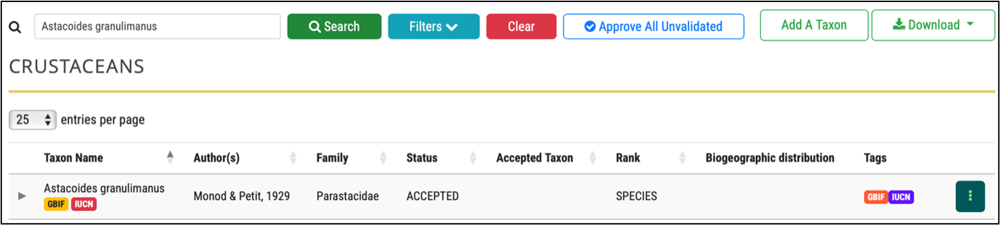

### Filter taxa

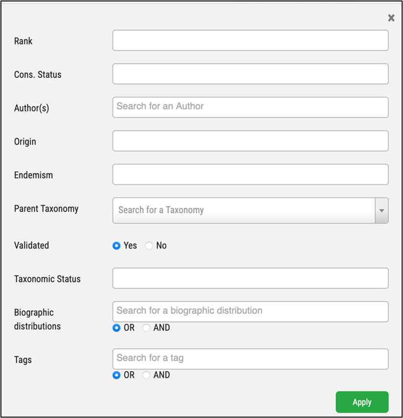

### Sort taxa
Taxa can be sorted using up  arrow, by each of the headers given below.

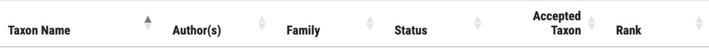

### View the GBIF and IUCN pages
Clicking the GBIF and IUCN buttons will take you to the taxon pages on each respective website.

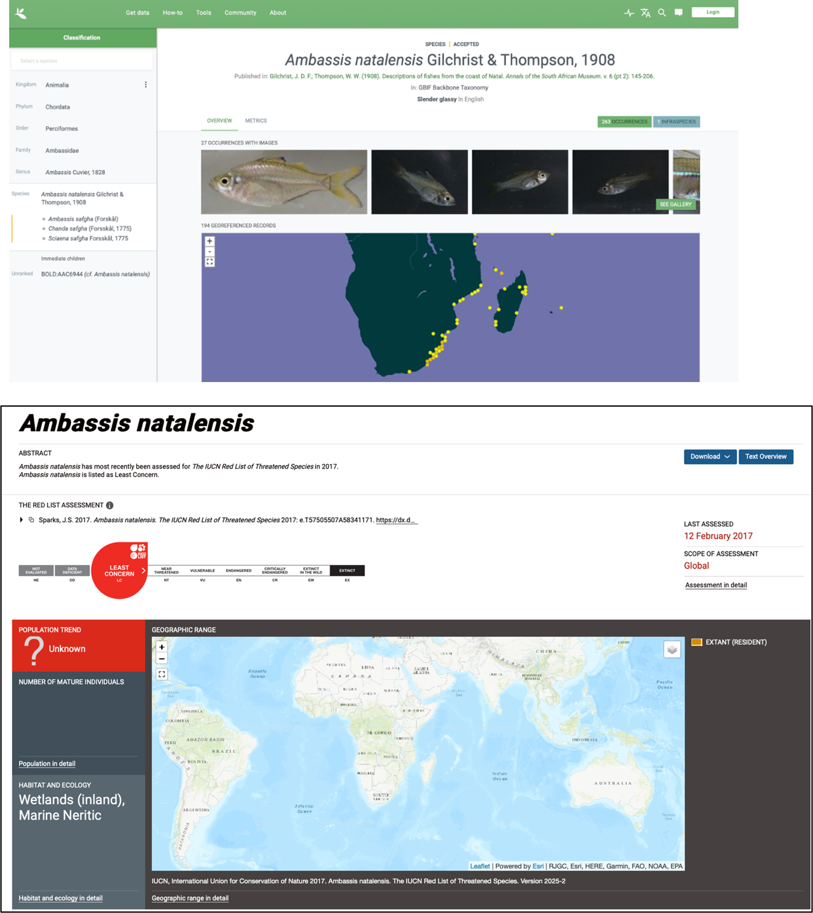

### View a Taxon's details
Expand a taxon by clicking the  next tp the taxon name to view Supra-generic Information, Infra Categories, Valid/Accepted Names, Conservation Status, and Common name. 

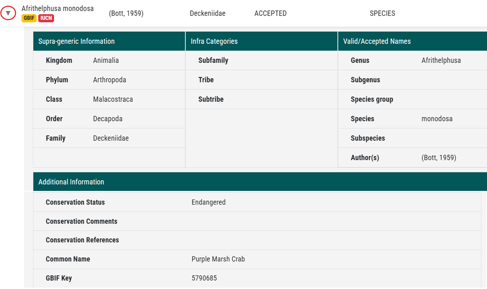

### View Tags
Tags are uploaded to provide information on taxonomic backbone, wetland dependency etc. These tags are generally platform specific and not all platforms have tags. 

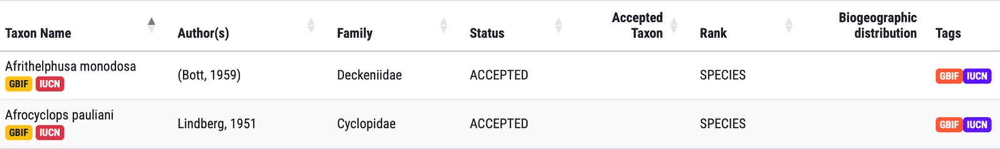

Users can aso filter tags by going to the Map > clicking Search on the toolbar > Taxon Tags > selecting tag(s) > Apply

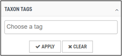

### View occurrence records per taxon 

Users can see how many occurrence records are associated with a taxon. When clicked, you are taken to the map where taxon records are displayed. 

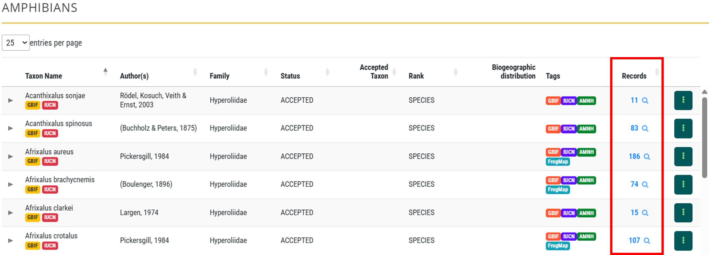

In taxon management, only the total records for that specific taxon are shown. On the map, records are aggregated across accepted names and associated synonyms that are on the Master List. 

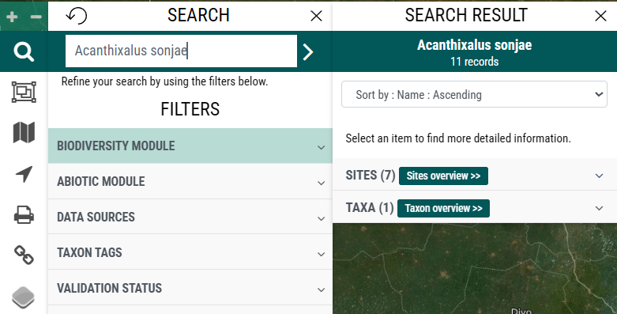

### Downloading taxa
All taxa in a group can be downloaded as a CSV file or checklist pdf.

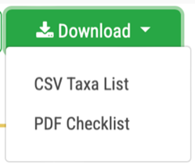

Users can also apply filters to select a subset of the taxa in a taxon group. The download will then include those selected taxa.

**CSV**

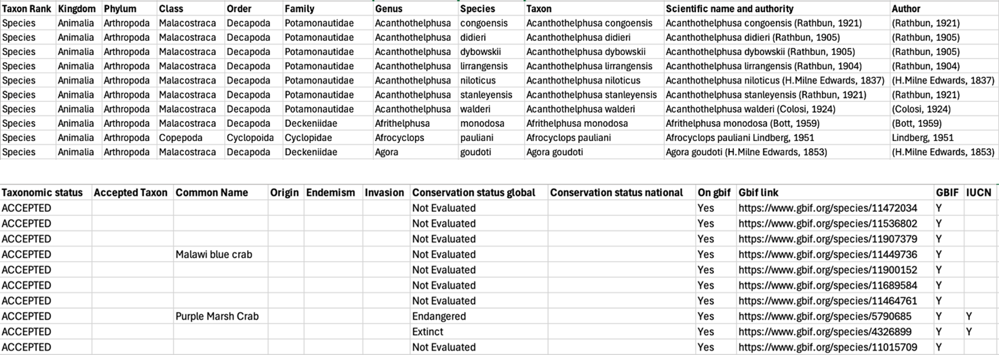

**PDF**

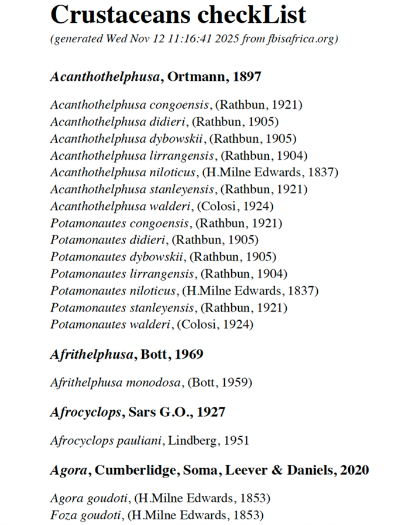

## Administrator View

Administrators, in addition to the functionality all users have access to (listed above), are able to do the following:

- [Add or update a Taxon Group Name and logo](#add-or-update-a-taxon-group-name-and-logo---edit-module)
- [Edit a Taxon’s details](#edit-a-taxons-details)
- [Add a new Taxon](#adding-a-new-taxon)
- [Remove a taxon from the taxon group](#remove-a-taxon-from-the-taxon-group)
- [Add images of a taxon](#adding-images-of-a-taxon)
- [Add additional attributes specific to a taxon group](#adding-additional-attributes-specific-to-a-taxon-group)
- [Add and edit tags specific to a taxon group](#add-and-edit-tags-specific-to-a-taxon-group)

### Add or update a Taxon Group Name and logo - edit module

The name of the Taxon Group and logo can be updated easily by highlighting the group, and clicking “Edit” indicated by the pencil, then typing the new name in “Label”, and browsing to the correct logo.

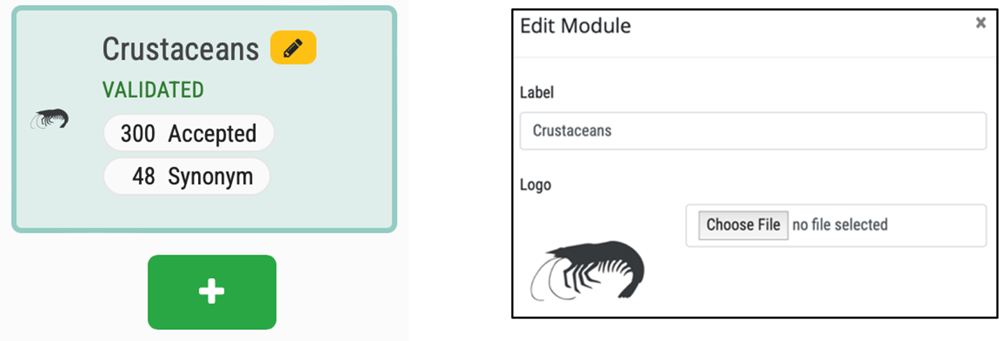

### Edit a Taxon's details
Admin can edit a taxon’s details in “Edit” or “Edit in Admin” by clicking the three vertical dots  (kebab menu) at the far right of the taxon row. The first is primarily used by taxonomists, while the second is useful for adding origin and endemism. 

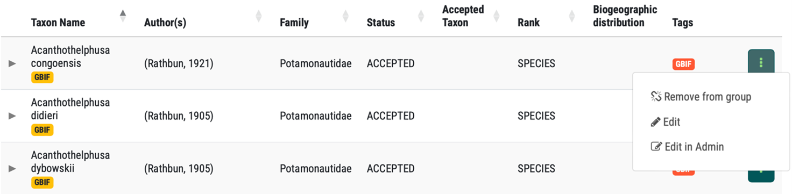

### Edit in Admin

 “Edit in Admin” opens up a pop up window that is the taxon in BIMS>Taxa. Here you can check and update additional details of a taxon.

Often Origin, Endemism and Invasion are uploaded when the master list is uploaded, but there are times when it is useful to edit these on the BIMS>Taxa form. The options for selection are managed in BIMS>Endemisms and BIMS>Invasions, while Origin is hard-coded.

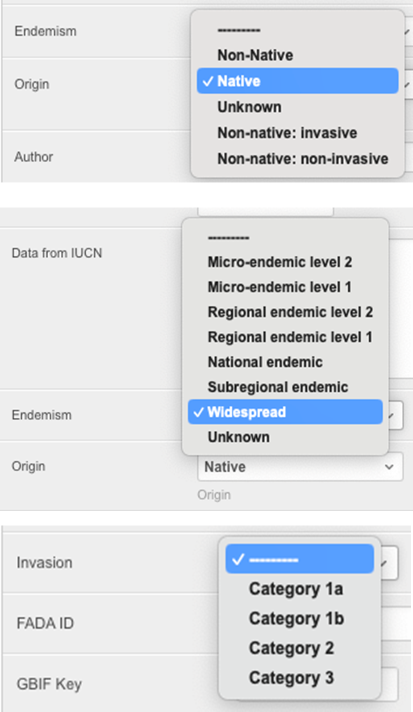

### Adding a new Taxon

If a new taxon needs to be added to the group, click the “Add a Taxon” button, type in the species name, and click “Find”. 

 If the Taxon is on GBIF it will provide the link to the GBIF taxonomic backbone, then click “Add” to confirm the addition of the new taxon to the taxon group.

If the taxon is not on GBIF, the administrator may add the new taxon, after which they must assign it to the appropriate Family and indicate the taxonomic rank of the new taxon. Taxa at all taxonomic levels may be added, although it is generally genus and/or species that are added.

Then edit details of the taxon by following the [Edit in Admin](#edit-in-admin) process.

### Remove a taxon from the taxon group

This needs to be used with caution. If data are associated with the taxon, then you will not be able to delete the taxon.

### Adding images of a taxon

By default images of a taxon are harvested from GBIF is they exist. In some instances an administrator may want to add images of a taxon themselves. To do this:

* Open Taxon Management
* Select the Taxon Group
* Select the Taxon and click Edit in Admin
        
* Go to the bottom of the “**Change Taxonomy**” form and add an image by browsing to the file. This image will then replace any GBIF image. Several images may be added for a taxon if desired.

    
* Click “Save”.

### Adding additional attributes specific to a taxon group

It may be desirable to add attributes for specific taxon groups such as “Water dependence” (Highly dependent, Moderately dependent, Minimally dependent, Terrestrial). These additional attributes are assigned to each taxon during the uploading of the master lists as long as the additional attribute is added in Taxon Management before uploading.

This is done in the Edit Module form, Add attribute. The attribute needs to match the attribute column header in your Master List for uploading.

You can add taxon specific attributes to a taxon group by adding additional column to the Master list and uploading , or individually by adding to the “**Change Taxonomy**” form:

* Open Taxon Management
* Select the Taxon Group
* Select the Taxon and click Edit

### Add and edit tags specific to a taxon group

Tags are used to provide additional categories about taxa in a module. They are uploaded with the column header being the tag name, and taxa populated with "Y" or "N" in the Master list. 

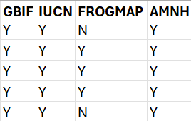

Taxa with Y will receive that tag name in taxon management. 

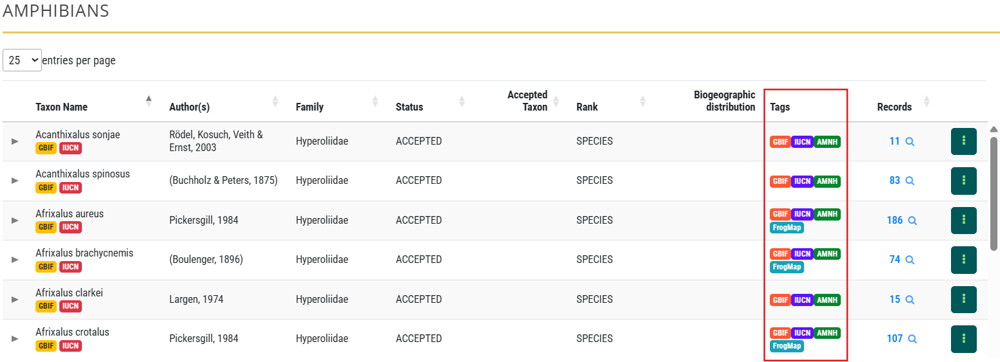

They can be edited in Admin>Taggit>Tags

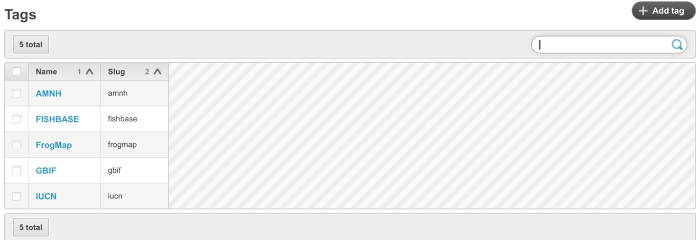

To edit the colour of a tag, you need to create a group and add colour in Admin>Bims>Tag Group

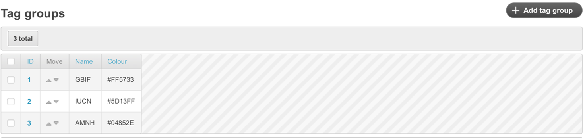
