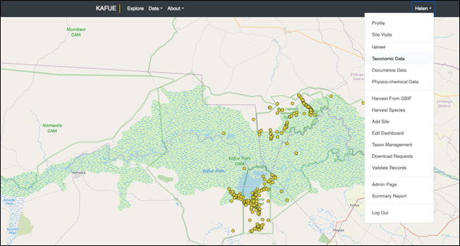
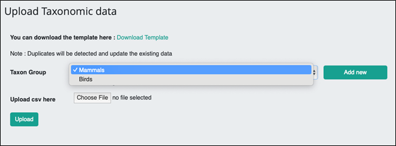
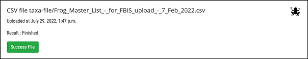
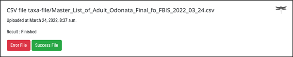

# Creating a new Taxon Group (Biodiversity Module), creating a Master List from GBIF and uploading a Master List of Taxa

> Only registered users with **super user status** are able to do this, typically the administrators.

Suggested workflow is to: 
* Create a new Biodiversity Module / Taxon Group.
* Upload Taxonomic data if a Master List exists.
* Harvest GBIF taxa (species) for the group, if no Master List exists.
* Download and edit Master list if needed.
* Harvest GBIF occurrence records for the group.

## Steps

Click on your name and select Taxon Management

Click + and Add a New Module, Add Name (Label) and Logo by browsing to a suitable logo already created. A useful website for logos is found here: https://www.phylopic.org.  Click Save.

**Add a Taxon** that you will be using as a parent. E.g. Tracheophyta as the parent Phylum for Plants. 

Approve/validate the Taxon. Clear the filters to see the new taxon added

Click "edit" on the taxon group, by clicking the pencil icon in the taxon group list. A popup will be displayed. In the bottom field, you can see the GBIF taxonomy; choose the new taxon here. (Type the first few letters to get options). Click Save.

Additional functionality allows you to: 

* Assign an expert - relevant for FADA only
* Select a parent taxonomy
* Add a customised Master List/Taxon upload template, and/or occurrence upload template. The default is the standard template. If extra attributes are added then the customised template can be uploaded. 

To harvest GBIF species/taxa go to Harvest Species. Now, when you harvest taxa, it will check all the taxa related to the GBIF Taxonomy that was added to the Taxon Group. 

Select the Boundary and Taxon Group and click **Start Harvesting**

**Note that only one GBIF harvest can happen at a time per user, either for species or occurrences.**

Further management and editing of the Master list is done in Taxon Management.  It is also recommended that once an initial master list is created using harvest species from GBIF, that it is downloaded as a csv, edited with additional data such as Origin and Endemism, and reuploaded with extra attributes added as needed. See section below.

If a Master list is created without using GBIF, or an edited Master list needs to be uploaded, then it can be uploaded as follows:

Click on your name and select **Upload Taxonomic Data**

Select the new Taxon Group using the dropdown and browse to the file containing the Master List of Taxa for the Taxon Group, click Upload.

Progress is shown:

A **Success** File will indicate taxa uploaded to the system. An **Error** file will give details of taxa not uploaded. The last column in this csv file provides an indication of the reason the taxon was not uploaded. The administrator then needs to check the data and correct before uploading again.

Once the Master List of Taxa has been added it can be viewed in the Taxon Management section.

An **Error File** provides details of the problem in the last column of the csv. Once these have been corrected, the file can be uploaded again.

New taxa may be added individually using the **Taxon Management**, or if there are multiple new taxa to be added, then the steps can be repeated, to upload the additional new taxa for the Taxon Group.