# Add Spatial Filter

Once you have uploaded a spatial layer, you can add it as a spatial filter for BIMS instance.

As an admin/super user, access the `Spatial Filters` page by clicking on 1️⃣ your username in the top right corner of any page and then click on 2️⃣ `Spatial Filters` on the dropdown menu.

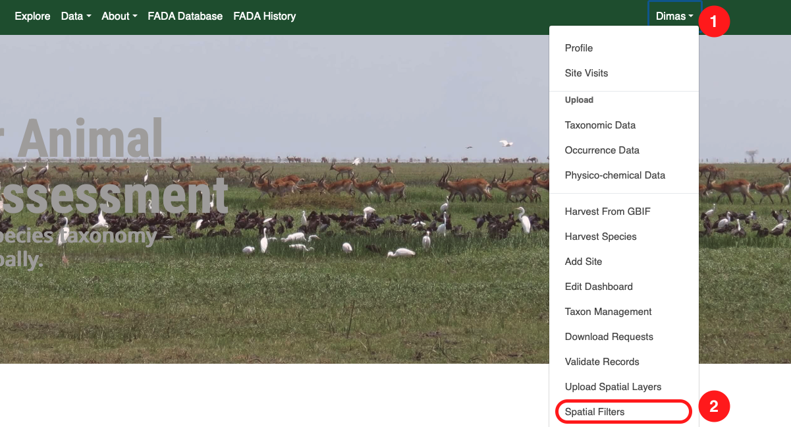

## Add Spatial Filter Section

On the `Spatial Filters` page, you can add a new section, which will appear as a section tab in the map view.

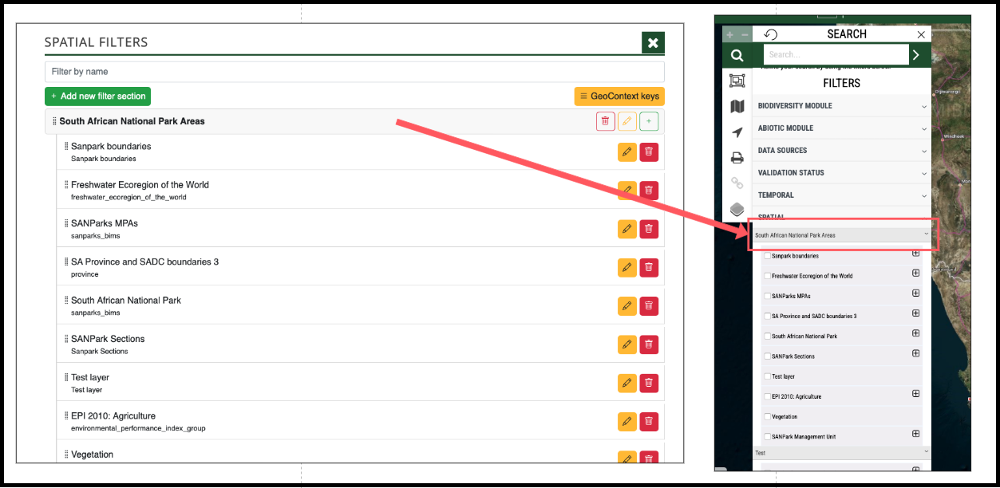

To add a section, click on 1️⃣ the `Add new filter section` button.

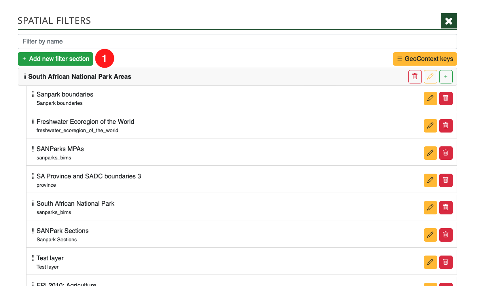

To add a new filter section, fill in the following field:

1. Name – Enter the section name.

Once completed, click the Save button 2️⃣ to submit.

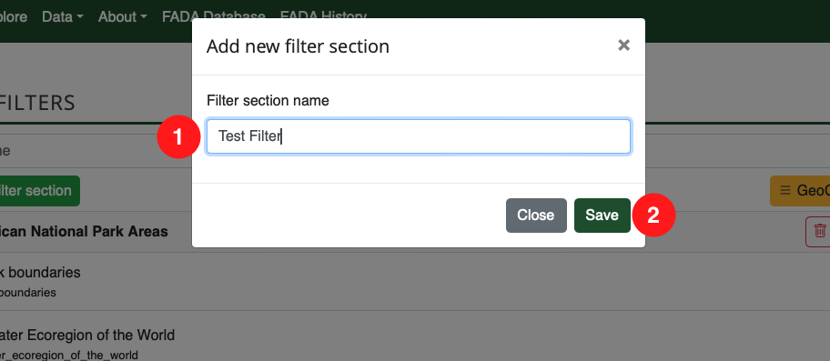

Your new filter section will then be added to the bottom of the list on the `Spatial Filters` page.

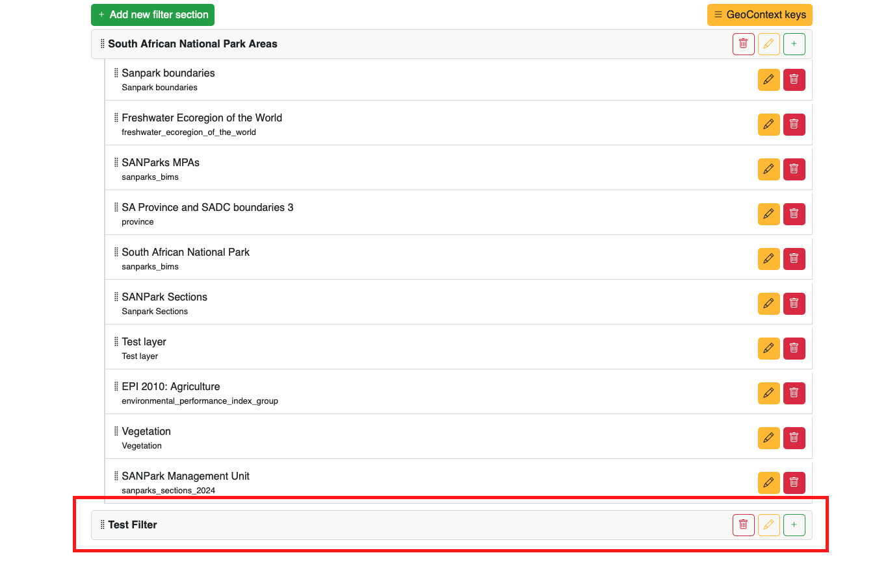

If you navigate back to the map on the BIMS instance, click 1️⃣ the `Search` button, and then click 2️⃣ `Spatial Filter`, you will see the newly created filter section.

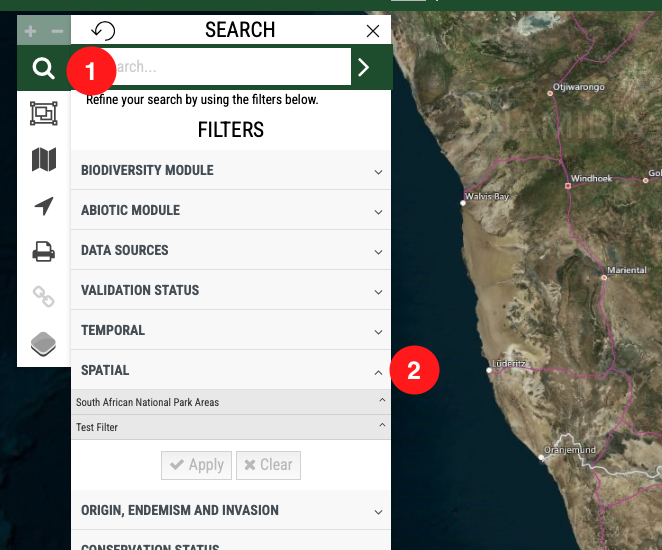

If you need to change the position of your filter section in the list, go to the `Spatial Filters` page. Click and hold the drag icon, then move the section to your desired position.

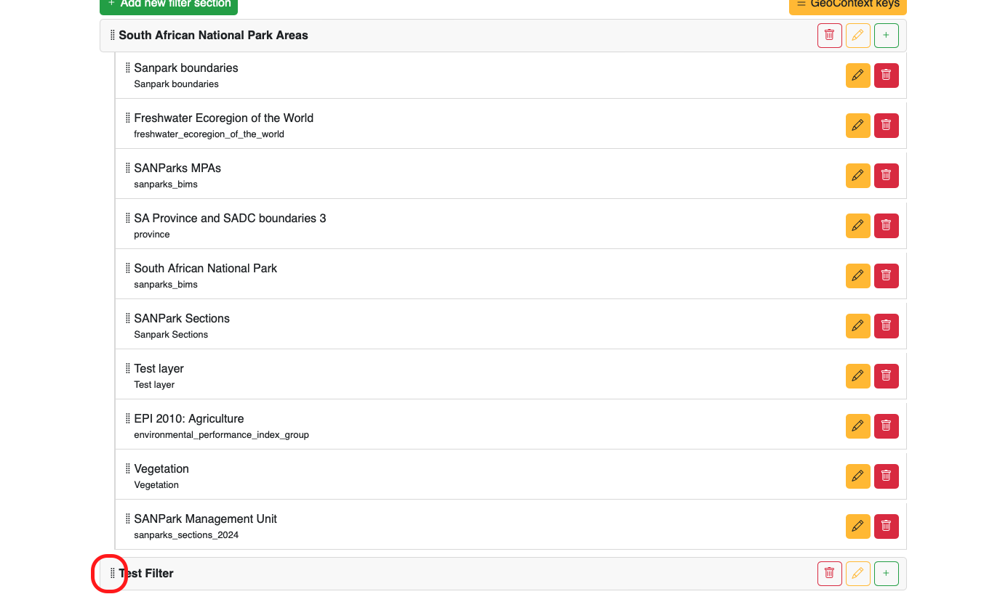

## Add Spatial Filter Context

A spatial filter context refers to the items added under the `Spatial Filter section`. The system uses this context to retrieve data from the associated spatial layer.

For example, if you add `Sanpark boundaries` as a context 1️⃣, the system will extract Sanpark filter data using the provided key. These filters will then appear as selectable options 2️⃣ on the map.

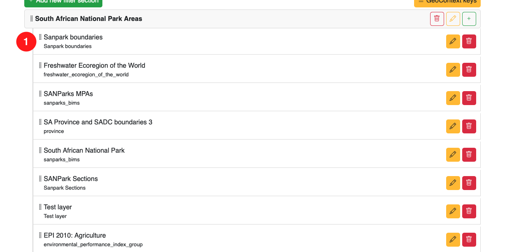

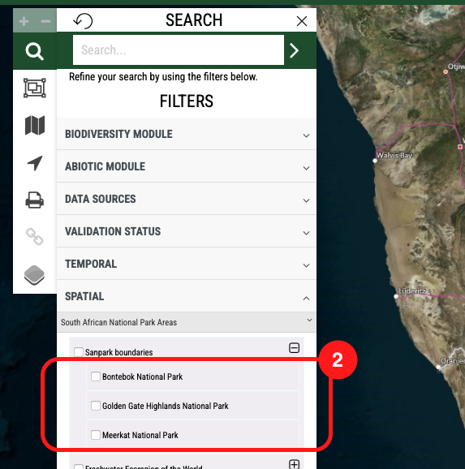

To add a `Spatial Filter Context`, you first need to specify which attribute from the layer will be used to extract values. This requires adding a GeoContext key.

Click 1️⃣ the `GeoContext keys` button to proceed.

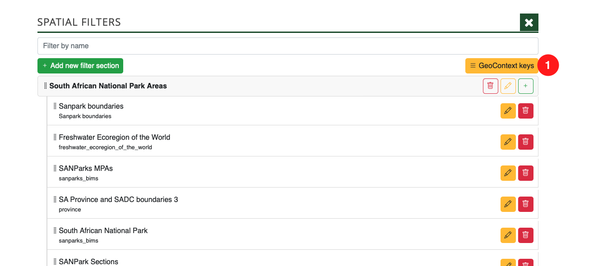

The `GeoContext Keys` modal will appear. Click the `Add New Key` button.

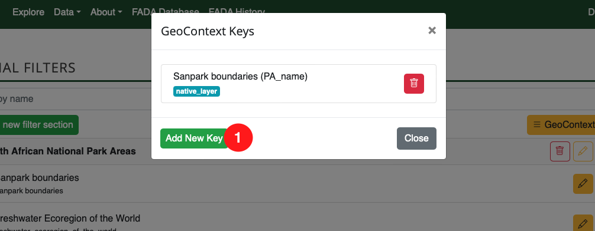

In the `Add New Key` modal:

- 1️⃣ Select a layer – Choose the layer you want to use. You can select your uploaded layer here.
- 2️⃣ Choose an attribute – Select the attribute the system will use to extract data.

Once done, click `Save`.

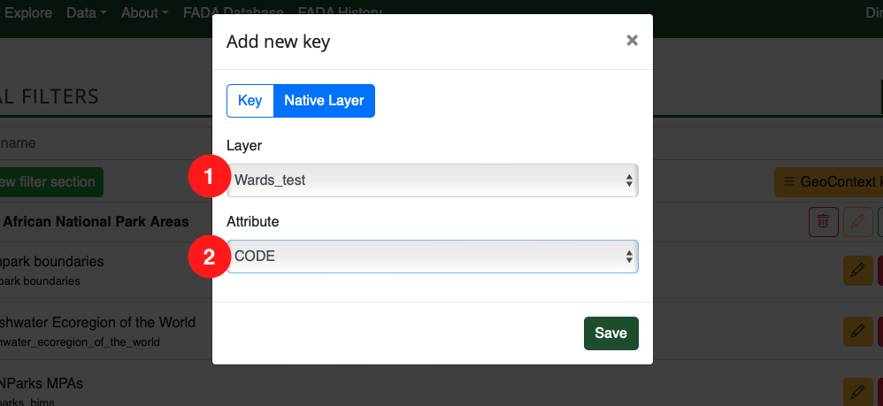

Your new context key should appear here. If you want to use a different attribute for the layer, simply remove the key by clicking the wastebasket icon and add a new one. 

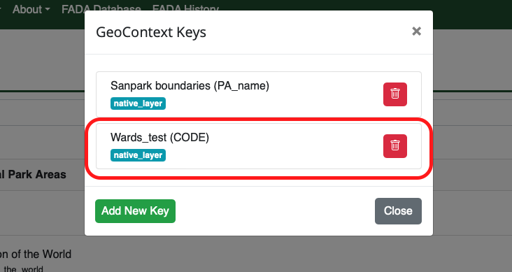

Close the modal, and now you can add the new context to the Spatial Filter section.
To do this, click the plus (+) button 1️⃣ in the section panel.

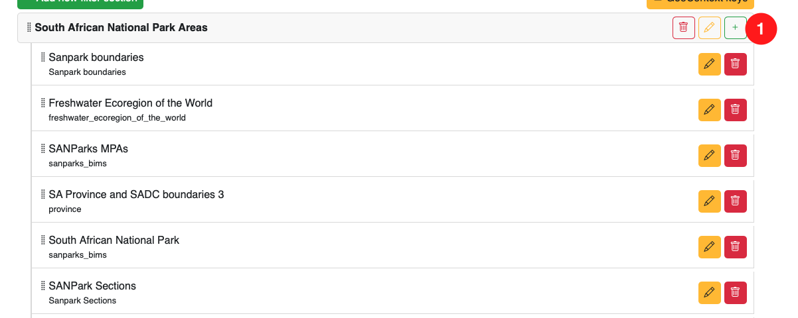

In the `Add New Context` modal, locate your newly added key using the input field 1️⃣. The field supports autocomplete, so you can start typing part of the title, and it will automatically search for matching keys.
Once you've selected the key, click the `Add` button to proceed.

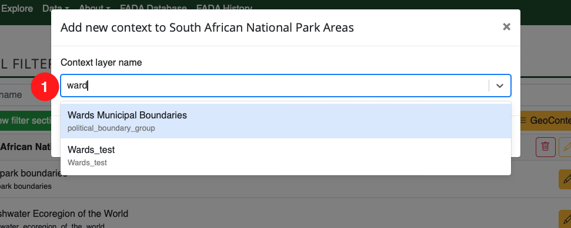

Your new context will be added to the bottom of the list.

To rearrange its position, simply drag the drag icon located to the left of the text.

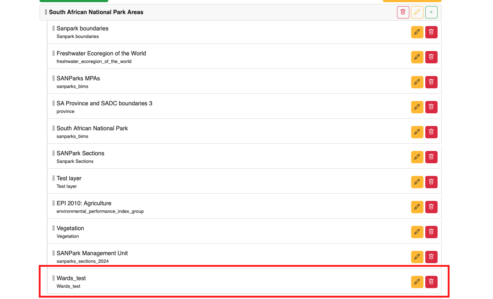

When you return to the map view and open the `Spatial Filter` panel, you will see your newly added spatial filter context. However, no data will be available yet because the system hasn't harvested it.

You can wait for the system to harvest the data automatically, but for the current setup, it's better to trigger the harvester manually. Follow the next steps to do that.

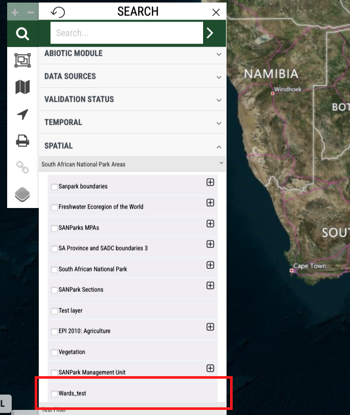

As an admin/superuser, visit the following URL:

🔗 `https://[your-bims.site.com]/admin/bims/locationsite/`

This will open the Location Site Admin page.

Hover over the `Update GeoContext` button 1️⃣. A dropdown will appear with two options—select the second option 2️⃣ to avoid re-harvesting existing data.

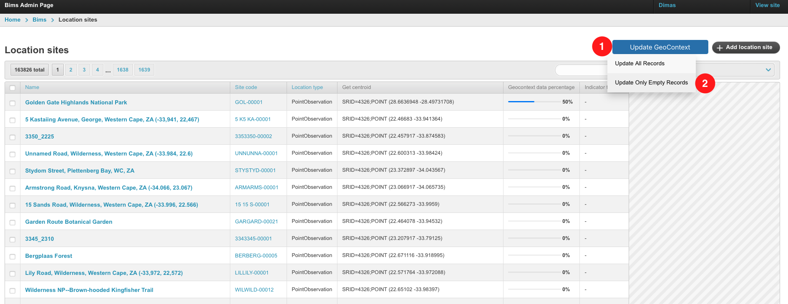

Once selected, the button will change to `Harvesting GeoContext...` 1️⃣, indicating that the system is currently processing data from the layers for all location sites.

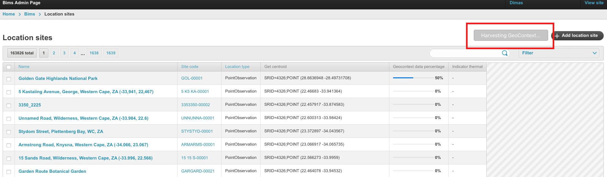

The harvesting process may take some time, depending on the number of sites in your BIMS instance.

To check if the process is complete, open the `Spatial Filter` panel on the map. If the sites now contain the context filter, it will be displayed there.

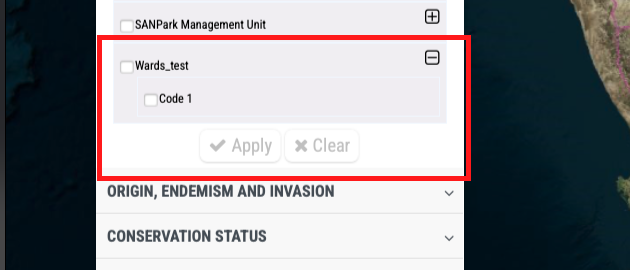