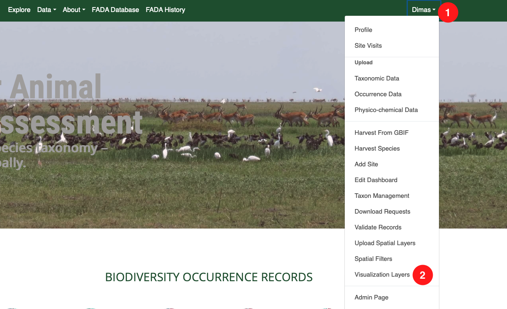
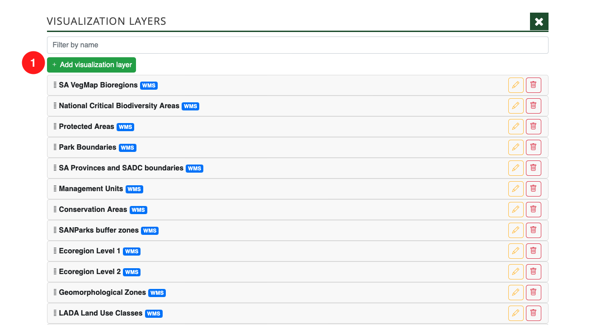

# Publish Spatial Layer on Map

Once you have uploaded and styled a spatial layer, you need to publish it on the BIMS instance so that it will display on the map.

As an admin/super user, access the `Visualization Layers` page by clicking on 1️⃣ your user name in the top right corner of any page and then click on 2️⃣ `Visualization Layers` on the dropdown menu.

On the `Visualization layers` page, click on 1️⃣ the `Add visualization layer` button.

On the `Visualization Layer` form, complete the following fields:

1. `Name`: The name that will appear in the layer selector on the map.
2. Choose the desired layer from the `Layer` dropdown list.
3. Select the appropriate style from the `Layer style` dropdown list
4. `Abstract`: A brief description displayed when clicking the `i` icon in the layer selector.

Once you have filled in the necessary fields, click on 1️⃣ the `Add` button.

Your layer will then be added to the bottom of the list of on the `Layers Visualization` page.

If you then navigate back to the map on the BIMS instance, click on 1️⃣ the `Layer Selector` button, and scroll to the bottom, you will see 2️⃣ the layer that was just published. You can then activate the layer to display it.

If you need to change the position of your layer in the list, go to the `Layers Visualization` page. Click and hold the drag icon, then move the layer to your desired position.

