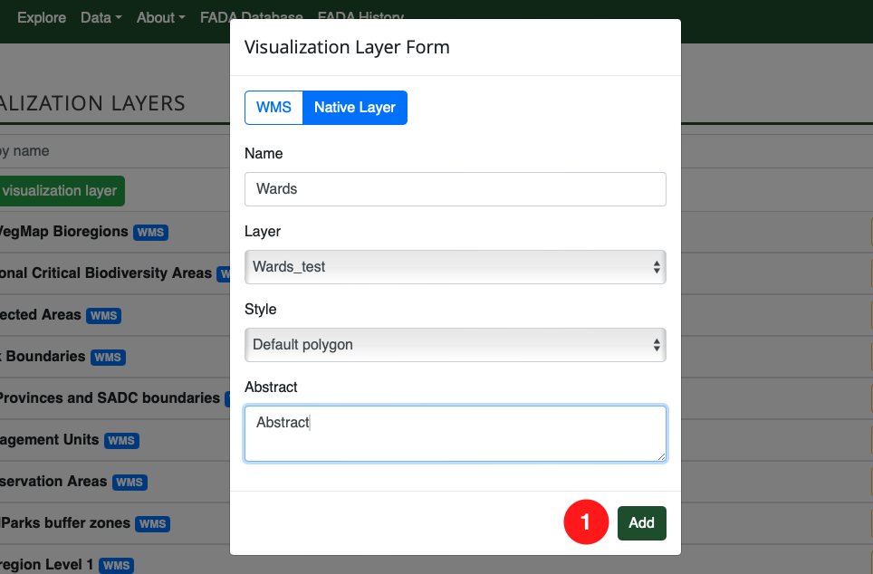
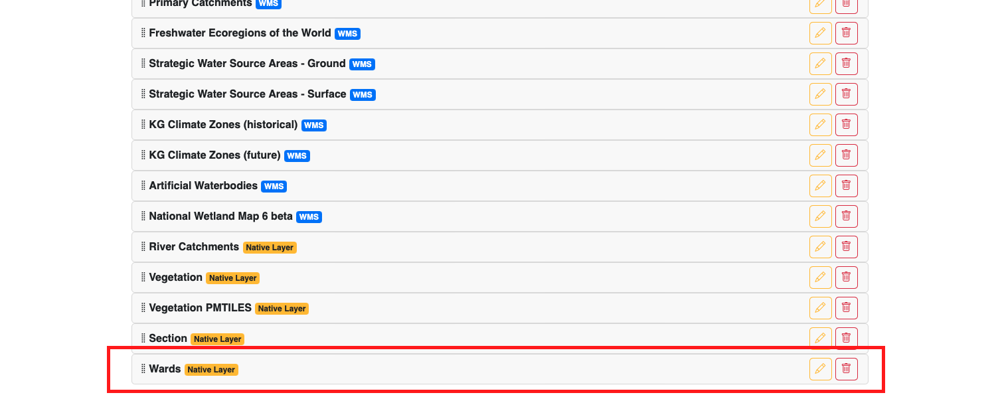
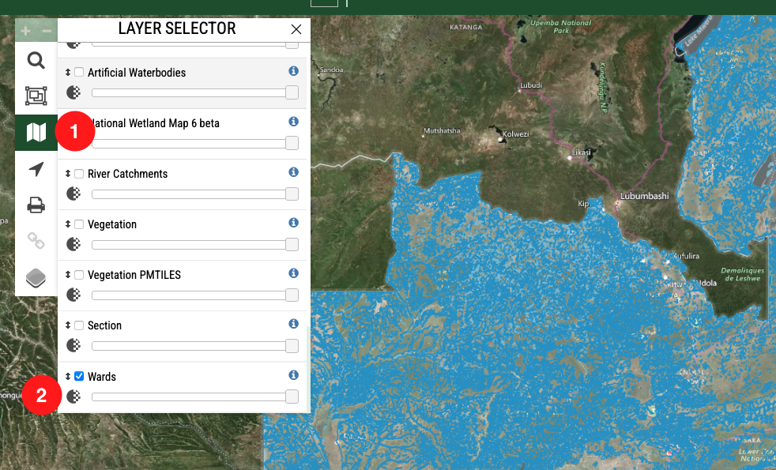

# Publish Spatial Layer on Map

Once you have uploaded and styled a spatial layer, you need to publish it on the BIMS instance so that it will display on the map.

As an admin/super user, access the `Administration` page by clicking on 1️⃣ your user name in the top right corner of any page and then click on 2️⃣ `Admin Page` on the dropdown menu.
> Note: If your BIMS instance has been customised, you may be able to hover your mouse pointer over `Administration` drop down menu from the top navigation bar.

On the `Admin` page, scroll down to the `Bims` section and then scroll down and click on 1️⃣ `Non biodiversity layers`.

On the `Non biodiversity layers` page, click on 1️⃣ the `Add non biodiversity layer` button.

On the `Add non biodiversity layer` page, you only have to fill in a few necessary fields.

1. `Name`: This will be the name on the `Admin` page.
2. `Layer name`: This will be the name displayed on the legend on the map.
3. Select your desired layer from the `Native layer` dropdown list.
4. Select your created style from the `Native layer style` dropdown list.

>Note: It is good practice for all 4 sections to be named the same thing so that there is no confusion as to whether the layer and the style are matched correctly.

Once you have filled in the necessary fields, click on 1️⃣ the `Save` button.

Your layer will then be added to the bottom of the list of on the `Non biodiversity layers` page.

If you then navigate back to the map on the BIMS instance, click on 1️⃣ the `Layer Selector` button, and scroll to the bottom, you will see 2️⃣ the layer that was just published. You can then activate the layer to display it.

If your layer needs to be displayed in a different position in the layers list, on the `Non biodiversity layers` page, click on 1️⃣ the `Move up` or `Move down` arrows.

