# BIMS: Styling Uploaded Layers

>Note: Only admin/super users can style spatial layers:

There are two methods to access the styling `Editor` page.

* [Access Method 1](#access-method-1-from-the-layer-upload-page): From the `Layer Upload` Page.
* [Access Method 2](#access-method-2-from-the-administration-site): From the `Administration` Page.

## Access Method 1: From the Layer Upload Page

To reach the `Layer Upload` page read through the [BIMS: Upload Spatial Layers](./upload-spatial-layers.md) guide. When you get to the [Access the Editor](./upload-spatial-layers.md#access-the-editor) section, you can click the link to return here.

## Access Method 2: From the Administration Page

As an admin/super user, access the `Administration` page by clicking on 1️⃣ your user name in the top right corner of any page and then click on 2️⃣ `Admin Page` on the dropdown menu.
> Note: If your BIMS instance has been customised, you may be able to hover your mouse pointer over `Administration` drop down menu from the top navigation bar.

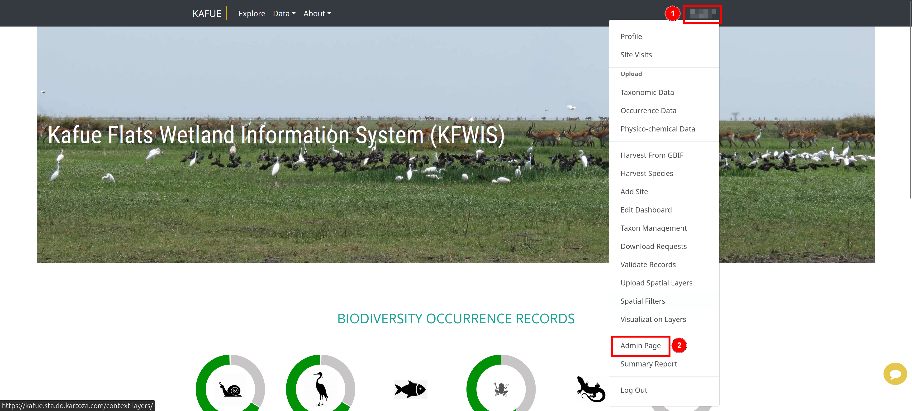

On the `Administration` page, scroll down to 1️⃣ the `Cloud Native Layers` section and then click on 2️⃣ `Layers`.

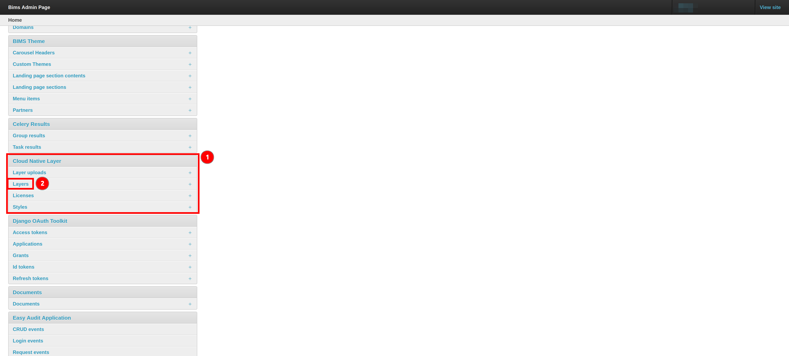

On the `Layers` page, click on 1️⃣ the `Editor` link next to your preferred layer to be redirected to the `Editor` page.

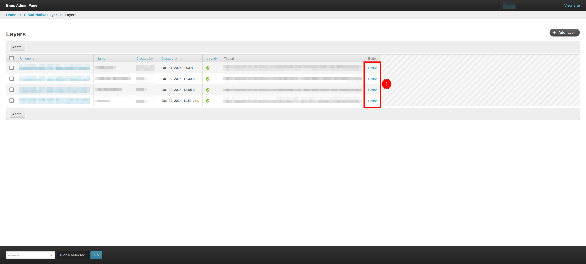

## The Maputnik Style Editor Page

When you first arrive on the Maputnik Style editor page, you are greeted by a world map with a default style for the layer.

If the layer has been previously styled, you can click on 1️⃣ the `Style` dropdown to select the style you would like to edit.

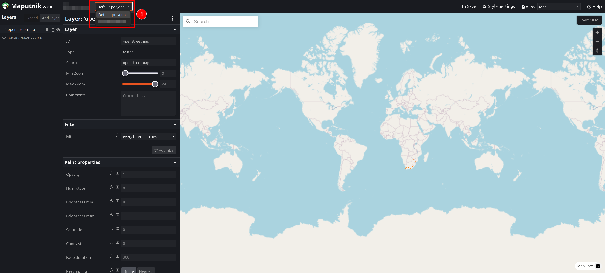

### Styling a Spatial Layer

Creating the styles using Maputnik can require multiple layers in the style per Spatial Layer. This is particularly prevalent if multiple colours are needed (i.e. in a categorized of graduated style that uses a colour ramp).

#### Basic Colour Change

To start styling a layer, zoom in on the area of the map where your layer should (e.g. This layer was for South Africa, so the map was zoomed in on South Africa).

If you would like to just change the colour of the layer, click on 1️⃣ the default style layer and then click on 2️⃣ the `Color` textbox that has a colour hexcode in it.

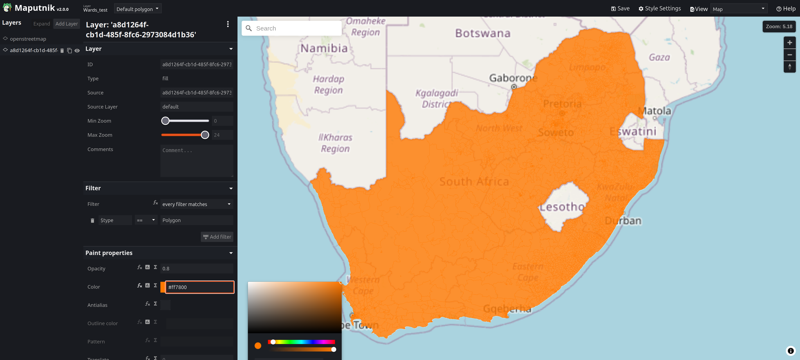

This will open a modal where you can either use 1️⃣ the various sliders and 2️⃣ colour box to select a colour, or you can paste the hexcode of the colour you would like in 3️⃣ the textbox (ensure there is a # before the six characters).

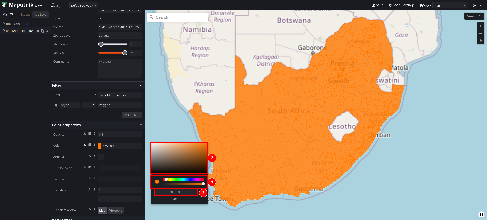

This will change the colour of the entire layer.

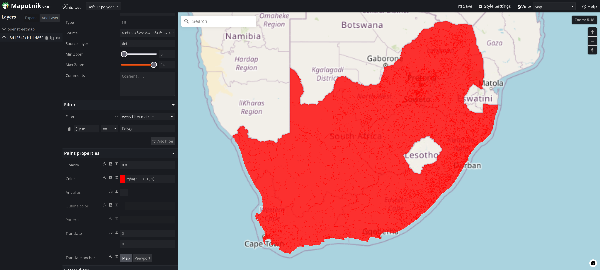

#### Basic Colour Based on Attribute

If you would like to style the layer based on an attribute you need to add a filter to your style layer and will need to add a new layer per different colour.

If you know the attribute name and attribute value you would like to use as a filter, you can can adapt the initial layer's filter to suit your needs. In this example, the attribute name is `Province` and the attribute value is `Northern Cape`.

If you are unsure of your filter requirements, you can click on 1️⃣ the `View` dropdown menu and then select 2️⃣ the `Inspect` option.

This will swap you to the inspection view, where you can use your mouse to click on features and display 1️⃣ a `Popup` with information about the feature(s) under your mouse.

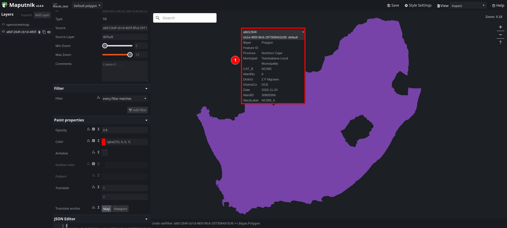

If features are not displaying in the `Inspection` view, click on 1️⃣ the `Delete` filter icon.
> Note: Only do this when you're initially identifying the attribute name and attribute value, otherwise you will be removing layers you want in your style.

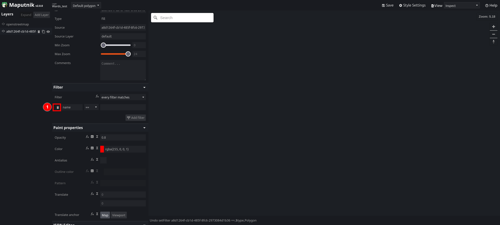

Once you have identified the attribute name and attribute value you would like to use, click on 1️⃣ the `Add Filter` button.

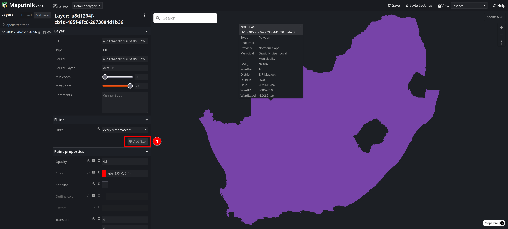

Then add the attribute name and attribute value in the respective boxes.

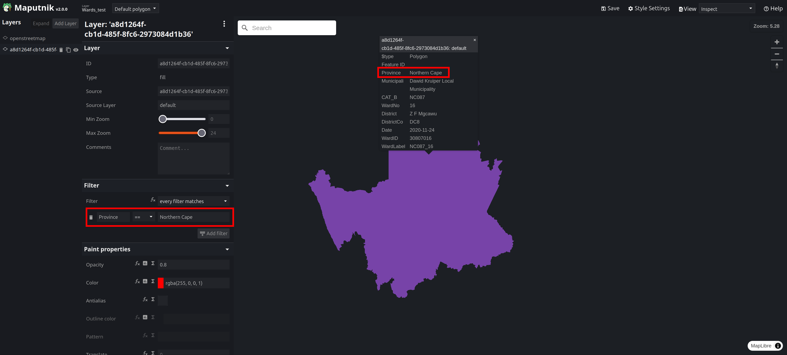

Switch back to the `Map` view by clicking 1️⃣ the `View` dropdown menu and then select 2️⃣ the `Map` option. You will only see your filtered features if you set up the filter correctly.

To then add a different coloured layer, you need to click on 1️⃣ the `Add Layer` button.

In the pop up that appears:

* Provide a temporary ID (i.e. a name for the layer) which will automatically be changed when the style is saved
* Select the `Type`: `Fill` is for polygons, `Line` is for line layers and `Circle` is for point layers. This example selected `Fill` as the layer is a polygon layer.
* Click on the Source Box and then click on the layer name that appears
* Type `default` into the Source Layer box.

Once you have filled in the fields, click on 1️⃣ the `Add layer` button.

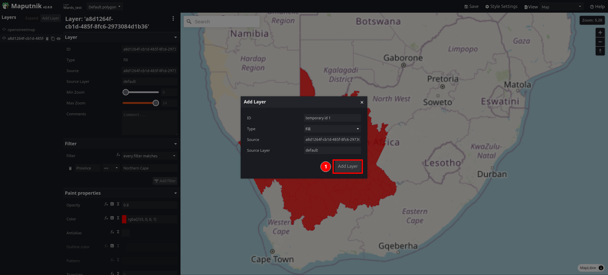

Add a filter to the new layer

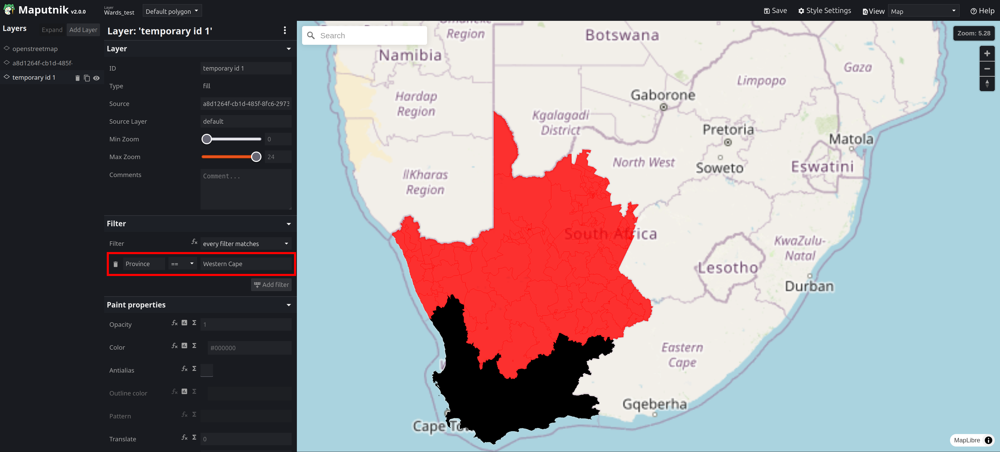

Change the colour of the newly added layer using 1️⃣ the various sliders and 2️⃣ colour box to select a colour, or by pasting the hexcode of the colour you would like in 3️⃣ the textbox (ensure there is a # before the six characters).

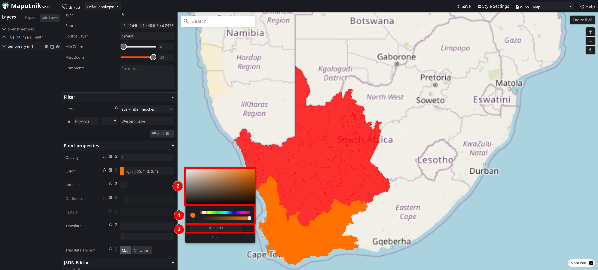

Add as many layers as necessary to display all of the desired features. This example has 9 layers to display the 9 provinces of South Africa.
> Note: To make changes to any layer, ensure you have the layer selected in the layer list.

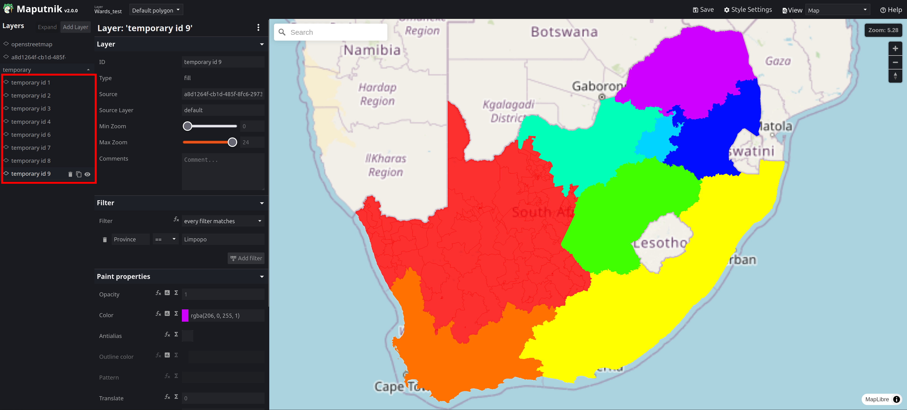

#### Basic Labelling of Features

If required, you can label features using the style editor. To label features, you will need to add a `Symbol` layer.

To start, you need click on 1️⃣ `Style Settings` to open the Style Settings menu.

In the menu that pops up, paste `https://api.maptiler.com/fonts/{fontstack}/{range}.pbf?key=cc4PpmmWZP73LjU1nsw3` into 1️⃣ the `Glyphs URL` box and then click on 2️⃣ the `X` to close the `Style Setting` menu.

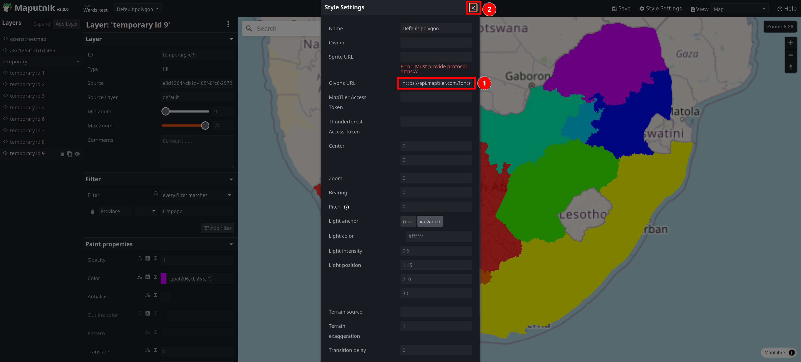

Once you have added the `Glyphs URL` to the style you can then click on 1️⃣ the `Add Layer` button.

In the pop up that appears:

* Provide a temporary ID (i.e. a name for the layer) which will automatically be changed when the style is saved
* Select the `Type` as `Symbol`.
* Click on the Source Box and then click on the layer name that appears
* Type `default` into the Source Layer box.

Once you add the symbol layer, you can add a filter to the layer if you would like to only label specific features and not the entire layer but this is not always necessary.

To display a label, you need to specify an attribute name in 1️⃣ the `Field` text box. The name must be surrounded by {} as in the example.

To adjust the placement of your labels on the feature use one of 1️⃣ the 3 `Placement` options. For polygons it is recommended to be left as `Point` and for lines it can be set to `Line-center`.

To adjust the spacing between labels, you can adjust 1️⃣ the `Padding` value in the `Text layout properties`.

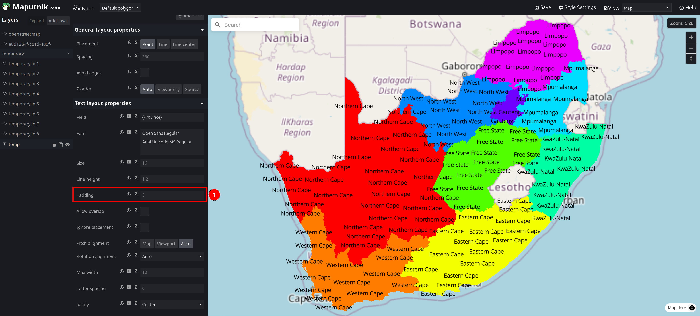

To change the text colour and add a halo, scroll down in the styling panel until you get to the `Text paint properties` section. Adjust 1️⃣ the text's `Color` using the colour box in the same manner as changing the colour of a feature, then adjust 2️⃣ the `Halo color` in the same manner. Finally adjust 3️⃣ the `Halo width` to your preference.

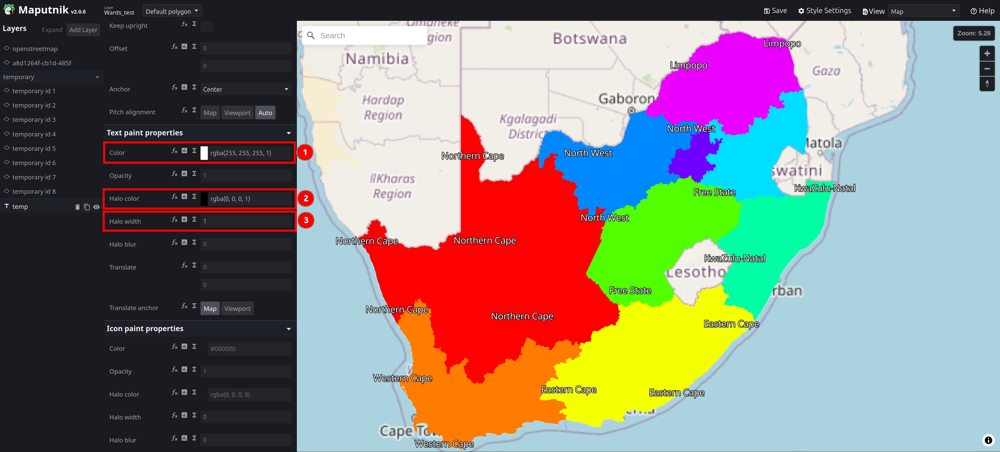

#### Saving the Style

Once you have finished creating your style, you can then click on 1️⃣ the `Save` button.

In the pop up window that appears, give your style 1️⃣ a `Name` that matches the name of the spatial layer that you are styling (e.g. If the spatial layer is called Wards, then give your style the name Wards), and then click on 2️⃣ the `Save as` button.

> Note: If you're editing a pre-existing style, you can just click on the `Save` button.
