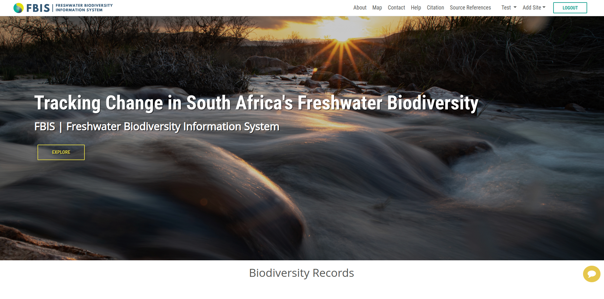
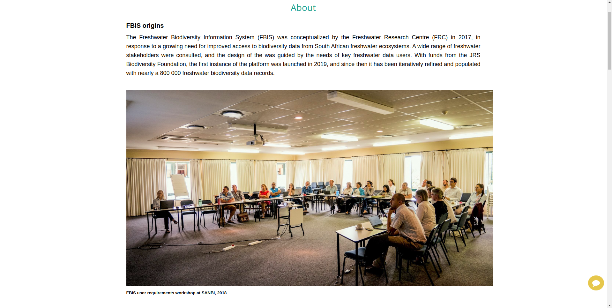
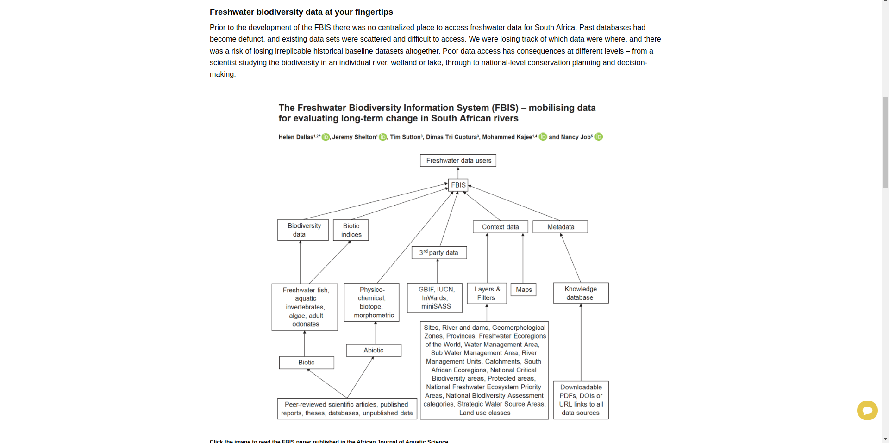
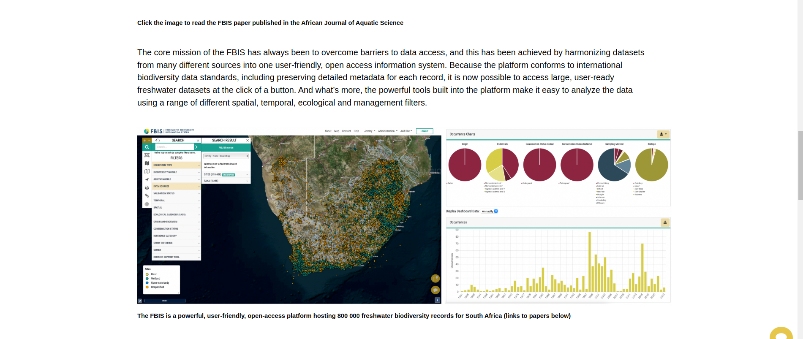
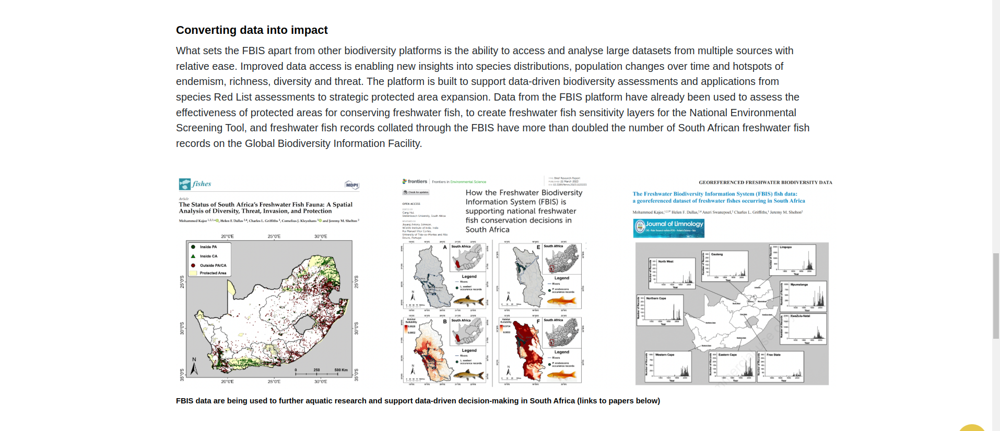
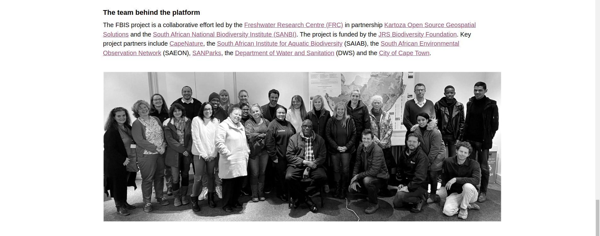
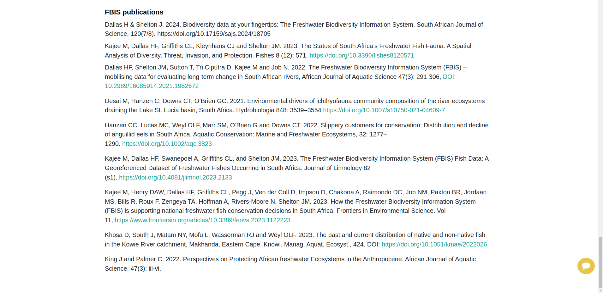

# About

This `About` section provides detailed information about the BIMS project. It offers insights into the project's objectives, purpose, and significance, helping users understand its scope and how it aims to address specific challenges. 

1. **About:** Click on the `About` tab from the navigation bar to access the about page.

* **FBIS origins:** The Freshwater Biodiversity Information System (FBIS) was conceptualized by the Freshwater Research Centre (FRC) in 2017, in response to a growing need for improved access to biodiversity data from South African freshwater ecosystems. A wide range of freshwater stakeholders were consulted, and the design of the was guided by the needs of key freshwater data users. With funds from the JRS Biodiversity Foundation, the first instance of the platform was launched in 2019, and since then it has been iteratively refined and populated with nearly a 800 000 freshwater biodiversity data records.

* **Freshwater biodiversity data at your fingertips:** Prior to the development of the FBIS there was no centralized place to access freshwater data for South Africa. Past databases had become defunct, and existing data sets were scattered and difficult to access. We were losing track of which data were where, and there was a risk of losing irreplicable historical baseline datasets altogether. Poor data access has consequences at different levels – from a scientist studying the biodiversity in an individual river, wetland or lake, through to national-level conservation planning and decision-making.  

* **Core mission of FBIS:** The core mission of the FBIS has always been to overcome barriers to data access, and this has been achieved by harmonizing datasets from many different sources into one user-friendly, open access information system. Because the platform conforms to international biodiversity data standards, including preserving detailed metadata for each record, it is now possible to access large, user-ready freshwater datasets at the click of a button. And what’s more, the powerful tools built into the platform make it easy to analyze the data using a range of different spatial, temporal, ecological and management filters.

* **Converting data into impact:** What sets the FBIS apart from other biodiversity platforms is the ability to access and analyse large datasets from multiple sources with relative ease. Improved data access is enabling new insights into species distributions, population changes over time and hotspots of endemism, richness, diversity and threat. The platform is built to support data-driven biodiversity assessments and applications from species Red List assessments to strategic protected area expansion. Data from the FBIS platform have already been used to assess the effectiveness of protected areas for conserving freshwater fish, to create freshwater fish sensitivity layers for the National Environmental Screening Tool, and freshwater fish records collated through the FBIS have more than doubled the number of South African freshwater fish records on the Global Biodiversity Information Facility. 

The FBIS project is a collaborative effort led by the [Freshwater Research Centre (FRC)](https://www.frcsa.org.za/) in partnership [Kartoza Open Source Geospatial Solutions](https://kartoza.com/) and the [South African National Biodiversity Institute (SANBI)](https://www.sanbi.org/). The project is funded by the [JRS Biodiversity Foundation](https://jrsbiodiversity.org/). Key project partners include [CapeNature](https://www.capenature.co.za/), the [South African Institute for Aquatic Biodiversity (SAIAB)](https://saiab.ac.za/), the [South African Environmental Observation Network (SAEON)](https://www.saeon.ac.za/), [SANParks](https://www.sanparks.org/), the [Department of Water and Sanitation (DWS)](https://www.dws.gov.za/) and the [City of Cape Town](https://www.capetown.gov.za/).

## FBIS publications

Dallas H & Shelton J. 2024. Biodiversity data at your fingertips: The Freshwater Biodiversity Information System. South African Journal of Science, 120(7/8). https://doi.org/10.17159/sajs.2024/18705

Kajee M, Dallas HF, Griffiths CL, Kleynhans CJ and Shelton JM. 2023. The Status of South Africa’s Freshwater Fish Fauna: A Spatial Analysis of Diversity, Threat, Invasion, and Protection. Fishes 8 (12): 571. https://doi.org/10.3390/fishes8120571

Dallas HF, Shelton JM, Sutton T, Tri Ciputra D, Kajee M and Job N. 2022. The Freshwater Biodiversity Information System (FBIS) – mobilising data for evaluating long-term change in South African rivers, African Journal of Aquatic Science 47(3): 291-306, DOI: 10.2989/16085914.2021.1982672 

Desai M, Hanzen C, Downs CT, O’Brien GC. 2021. Environmental drivers of ichthyofauna community composition of the river ecosystems draining the Lake St. Lucia basin, South Africa. Hydrobiologia 848: 3539–3554 https://doi.org/10.1007/s10750-021-04609-7 

Hanzen CC, Lucas MC, Weyl OLF, Marr SM, O’Brien G and Downs CT. 2022. Slippery customers for conservation: Distribution and decline of anguillid eels in South Africa. Aquatic Conservation: Marine and Freshwater Ecosystems, 32: 1277– 1290. https://doi.org/10.1002/aqc.3823

Kajee M, Dallas HF, Swanepoel A, Griffiths CL, and Shelton JM. 2023. The Freshwater Biodiversity Information System (FBIS) Fish Data: A Georeferenced Dataset of Freshwater Fishes Occurring in South Africa. Journal of Limnology 82 (s1). https://doi.org/10.4081/jlimnol.2023.2133 

Kajee M, Henry DAW, Dallas HF, Griffiths CL, Pegg J, Ven der Coll D, Impson D, Chakona A, Raimondo DC, Job NM, Paxton BR, Jordaan MS, Bills R, Roux F, Zengeya TA, Hoffman A, Rivers-Moore N, Shelton JM. 2023. How the Freshwater Biodiversity Information System (FBIS) is supporting national freshwater fish conservation decisions in South Africa. Frontiers in Environmental Science. Vol 11, https://www.frontiersin.org/articles/10.3389/fenvs.2023.1122223

Khosa D, South J, Matam NY, Mofu L, Wasserman RJ and Weyl OLF. 2023. The past and current distribution of native and non-native fish in the Kowie River catchment, Makhanda, Eastern Cape. Knowl. Manag. Aquat. Ecosyst., 424. DOI: https://doi.org/10.1051/kmae/2022026

King J and Palmer C. 2022. Perspectives on Protecting African freshwater Ecosystems in the Anthropocene. African Journal of Aquatic Science. 47(3): iii-vi. 
