# Add Biodiversity Data

[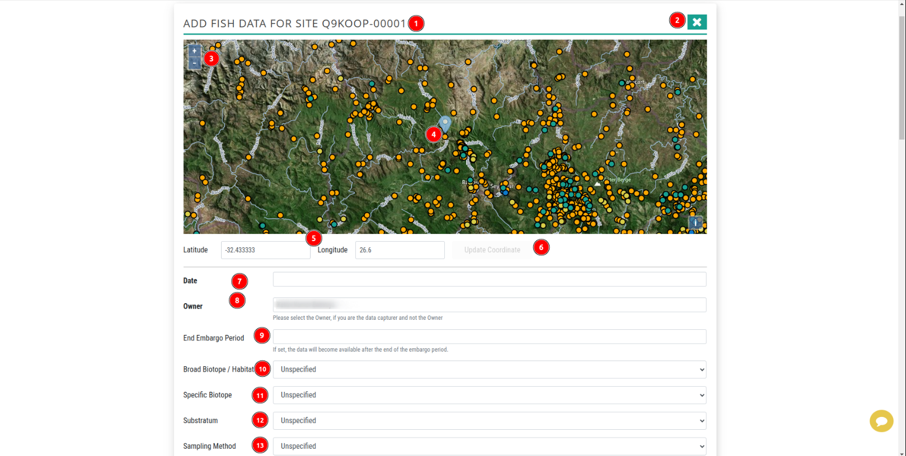](./img/add-biodiversity-data-img-1.png)

1. **Site Code:** This is the site code of the corresponding site to which the user is going to add data.

2. **X:** Users can click on this button to close the form.

3. **➕ and ➖:** Users can use these button to zoom in and zoom out on the map.

4. **Location Indicator:** This is showing the location of the site on the map.

5. **Longitude and Latitude:** These are the coordinates of the location of the site on the map.

6. **Update Coordinate:** Users can update the site's coordinates by inputting the new longitude and latitude values into the respective fields and clicking on this button to save the changes.

7. **Data:** This is the date when the data was added.

8. **Owner:** Owner of the data.

9. **End Embargo Period:** This is the date when the data will be available for public access.

10. **Broad Biotope / Habitat:** Select the type of overarching biotope or habitat characterising the site from the drop-down menu.

11. **Specific Biotope:** Select the specific biotope from the drop-down menu.

12. **Substratum:** Select the type of substratum from the drop-down menu.

13. **Sampling Method:** Select the sampling method from the drop-down menu.

[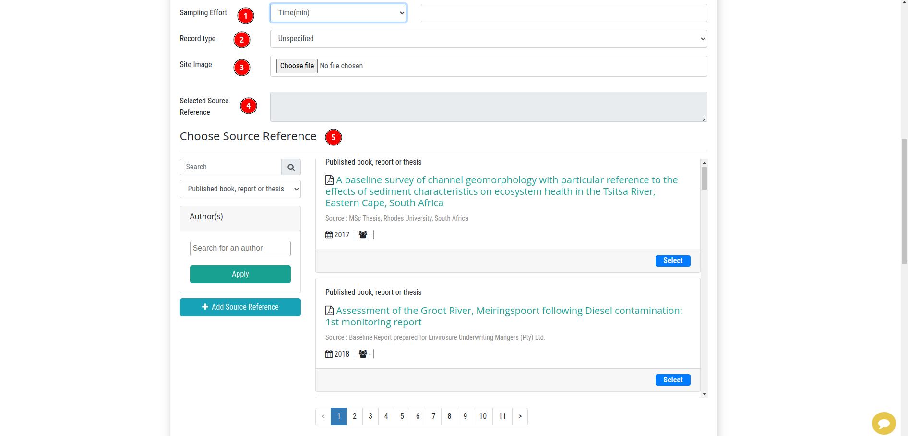](./img/add-biodiversity-data-img-2.png)

1. **Sampling Effort:** Users can input the sampling effort in the respective field.

2. **Record type:** Select the type of record from the drop-down menu.

3. **Site Image:** Users can upload an image of the site by clicking on this field. This action will open the file explorer, where users can navigate to the desired file, select it, and then click the `Select` button to upload the image.

4. **Selected Source Reference:** This contains the selected source reference.

5. **Choose Source Reference:** This section contains the source reference options.

    [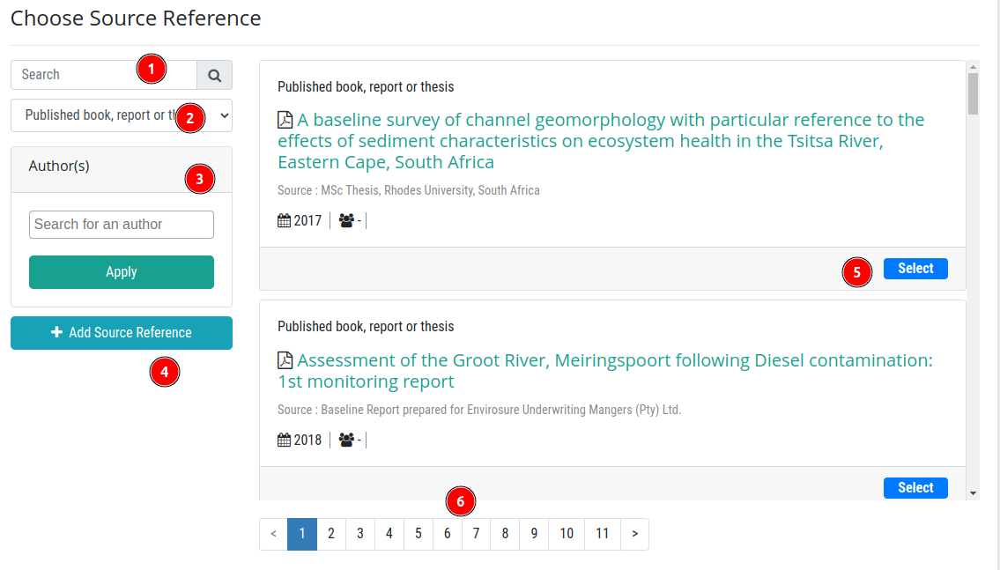](./img/add-biodiversity-data-img-3.png)

    1 **Search:** Users can search for a source reference by inputting the name in the search bar.

    2 **Dropdown menu:** Users can filter the sources by selecting the type of source from the dropdown menu.

    3 **Authors:** Users can filter the by entering the authors' names in the search bar.

    4 **Add Source Reference:** Users can add a new source reference by clicking on this button. For more information, please refer to the [Add Source Reference](./source-reference-page.md#add-source-reference) page.

    5 **Select:** Users can select the source reference by clicking on the `Select` button.

    6 **Pagination:** Users can navigate through the list of source references by clicking on the pagination buttons.

[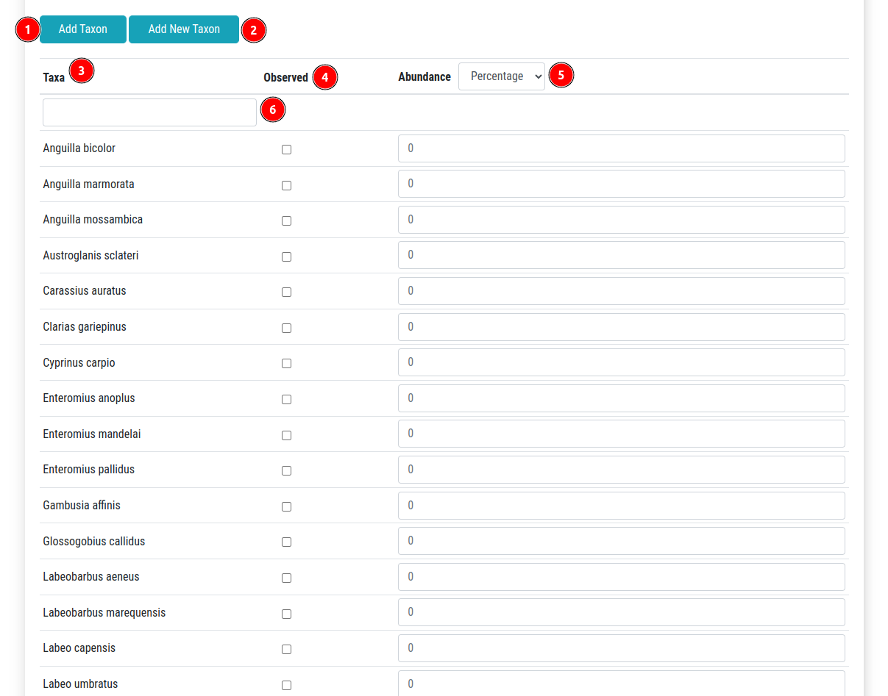](./img/add-biodiversity-data-img-4.png)

1. **Add Taxon:** Users can add taxon by clicking on this button.

2. **Add New Taxon:** Users can add a new taxon by clicking on this button.

    [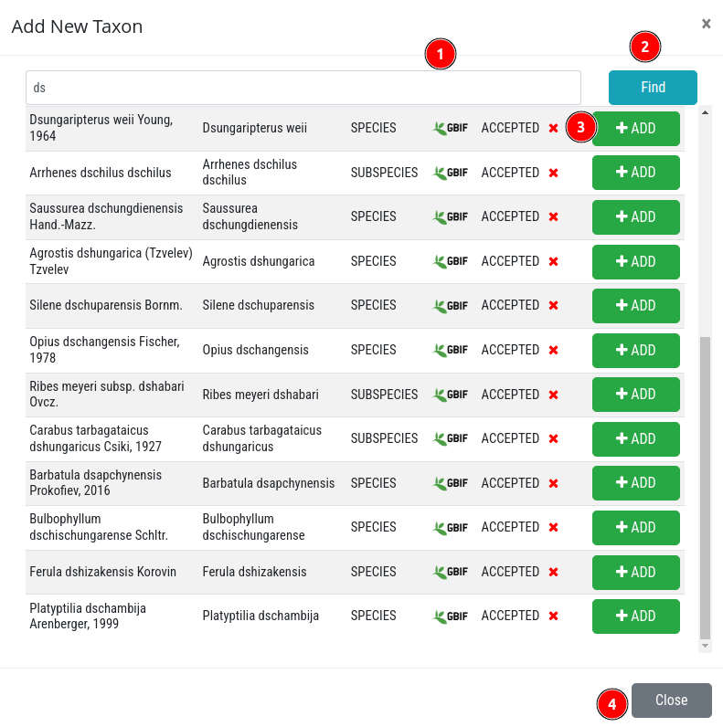](./img/add-biodiversity-data-img-10.png)

    1 **Search:** Users can search for a taxon by inputting the name in the search bar.

    2 **Find:** After entering the name in search bar, users can click on the `Find` button to search for the taxon.

    3 **Add:** Users can add the taxon by clicking on the `Add` button.

    4 **Close:** Users can close the taxon search window by clicking on the `Close` button.

3. **Taxa:** This is the column heading, indicating that this column contains the list of taxa.

4. **Observed:** Users can check the box to indicate that the taxon was observed.

5. **Abundance:** Users can input the abundance of the taxon in the respective field and select the unit from the drop-down menu.

[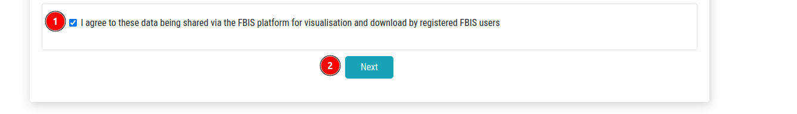](./img/add-biodiversity-data-img-5.png)

1. **Checkbox:** Check this checkbox to accept the agreement.

2. **Next:** Click on this button to proceed to the next step.

* After clicking the `Next` button, the user will receive an alert asking them to confirm whether they want to proceed with the data entry.

[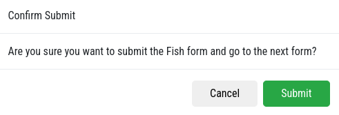](./img/add-biodiversity-data-img-6.png)

* **Cancel:** Users can cancel the process by clicking on this button.

* **Submit:** Users can confirm the data entry by clicking on this button.

    [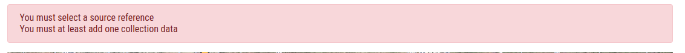](./img/add-biodiversity-data-img-7.png)

    * **Error:** If users forgot to fill in any of the required fields, they will receive an error message.

    * After successfully submitting the form users will be redirected to the next from.

        [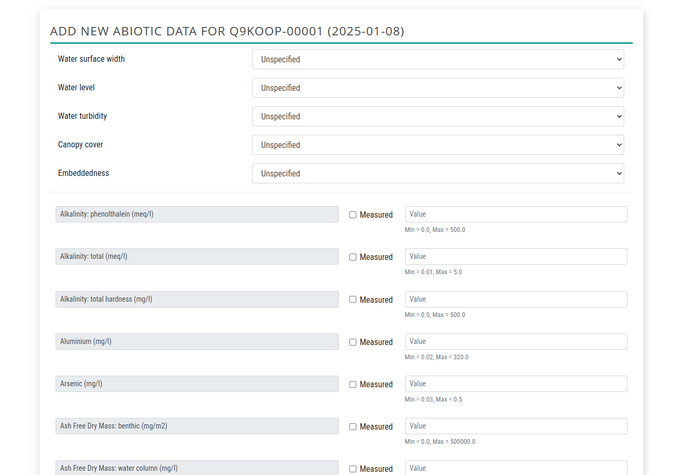](./img/add-biodiversity-data-img-8.png)

        - Users are required to fill in the necessary fields again, scroll to the bottom, and check the box to accept the agreement. Then, click the `Next` button to proceed to the next step.

After completing the process, the data will be added to the database.

[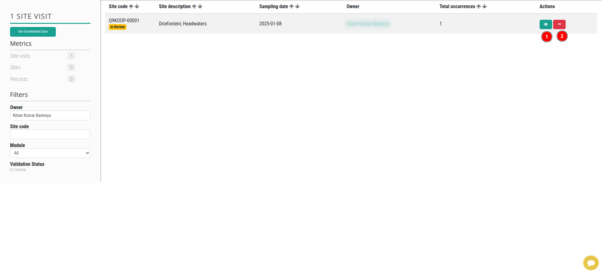](./img/add-biodiversity-data-img-9.png)

1. **:** Users can view the newly added data by clicking on this button.

    [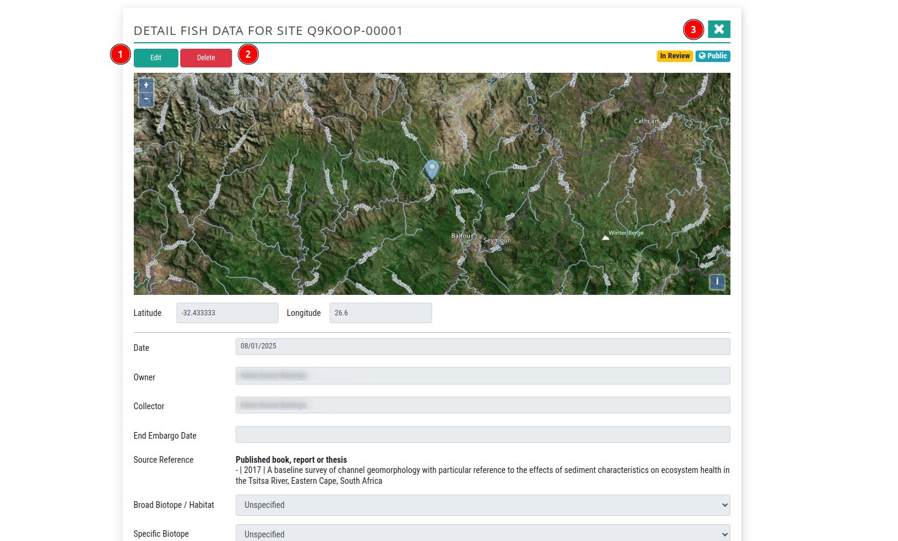](./img/add-biodiversity-data-img-13.png)

    1 **Edit:** Allows users to edit the data.

    2 **Delete:** This option allows users to delete the data. Upon clicking the `Delete` button, users will be prompted to confirm their decision to proceed with the deletion or cancel the process.

    [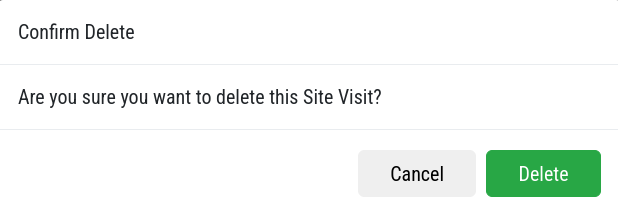](./img/add-biodiversity-data-img-14.png)

    * **Cancel:** Users can cancel the deletion process by clicking on this button.

    * **Delete:** Users can confirm the deletion by clicking on this button.

2. **:** Users can delete the newly added data by clicking on this button.

    

    * **Cancel:** Users can cancel the deletion process by clicking on this button.

    * **Delete:** Users can confirm the deletion by clicking on this button.
    