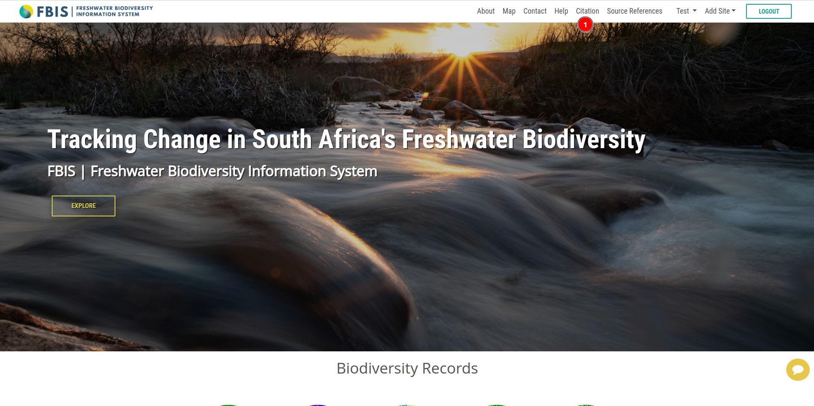

# Citation

1. **Citation:** Users can access the citation page by clicking on this tab in the top navigation bar.

## Citation guidelines

Data accessed through the FBIS are free for all—but not free of obligations. Under the terms of the FBIS data users agreement, users who download individual datasets or search results and use them in research or policy agree to cite them using the referencing information provided in the metadata for each data record.

Good citation practices ensure scientific transparency and reproducibility by guiding other researchers to the original sources of information. They also reward data-publishing institutions and individuals by reinforcing the value of sharing open data and demonstrating its impact to their stakeholders and funders.

Users are strongly encouraged to cite data retrieved from the FBIS network according to the recommended citation:

Freshwater Biodiversity Information System (FBIS). 2022. Downloaded from https://freshwaterbiodiversity.org on current date.

> Note: Users also need to cite the individual source references that they have used, which are available in the metadata table provided on the detailed dashboards.

* To cite the scientific article published in the African Journal of Aquatic Science

Helen Dallas, Jeremy Shelton, Tim Sutton, Dimas Tri Cuptura, Mohammed Kajee & Nancy Job (2022) The Freshwater Biodiversity Information System (FBIS) – mobilising data for evaluating long-term change in South African rivers, African Journal of Aquatic Science, 47:3, 291-306, DOI: 10.2989/16085914.2021.1982672

* To cite the User Manual

Freshwater Biodiversity Information System (FBIS). 2022. FBIS User Manual. Prepared by the Freshwater Research Centre and Kartoza.
