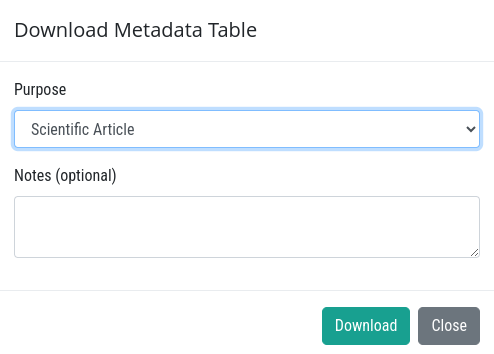

# Biodiversity Data Dashboard

The Single Site - Invertebrates dashboard provides a detailed view of data and insights for a selected site.

1. **:** The button at the top-right corner allows users to close the dashboard window.

2. **Filter History:** The Filter History section provides a detailed summary of the filters applied to generate the dashboard view. This section ensures transparency and clarity about the data presented by including the following details:

    * **Search Query:** Displays the unique query identifier used to retrieve data.

    * **Site ID:** Provides the identification code of the site, serving as a reference for the selected location.

    * **Ecosystem Type:** Lists the types of ecosystems associated with the site, such as rivers, wetlands, or open water bodies.

    * **Data Source:** Indicates the sources of data used in the dashboard, including FBIS, GBIF, and the Virtual Museum.

3. **Occurrence Charts:** Visualises key occurrence metrics in pie chart format.
    * **Categories:**

        * **Origin:** Displays whether species are native or introduced.

        * **Endemism:** Indicates the distribution range.

        * **Conservation Status Global:** Highlights specie's conservation status at the global level.
        
        * **Conservation Status National:** Highlights specie's conservation status at the national level.

        * **Sampling Method:** Details the data collection methodology.

        * **Biotope:** Represents habitat or ecological zones.

4. **:** This feature allows users to download specific sections of the data visualisation chart in SVG format.

* This is how the downloaded data will look like:

    

5. **Distributions:** Provides a geographical representation of the site's location on the interactive map.

    

    * **:** Allows users to download the map.

        

        * **Purpose:** Users can select their purpose for downloading the data from this drop-down menu, with options such as scientific articles, reports, theses, or other predefined categories. Custom purposes cannot be added, as users can only choose from the available options.

        * **Notes:** Adding additional notes to accompany the downloaded data is optional but available for users who wish to include them.

        * **Download:** Once the purpose and notes are selected, users can proceed to download the map.

        * **Close:** Users can close the download window by clicking the close button.

    * **`➕` and `➖`:** Users can zoom in and out of the map by clicking the `➕` and `➖` buttons respectively.

* **Display Dashboard Data:** Users can select whether they want to view annually or monthly data using this dropdown menu. 

    * **Annually:** If users select this option, the graph will display only the year in which the data was captured.

        

    * **Monthly:** If users select this option, the graph will display the year along with the month and date on which the data was captured.

        

6. **Occurrences:** Displays a bar chart representing the occurrences of invertebrates.

    * **:** Allows users to download the occurrences.

        

        * **Purpose:** Users can select their purpose for downloading the data from this drop-down menu, with options such as scientific articles, reports, theses, or other predefined categories. Custom purposes cannot be added, as users can only choose from the available options.

        * **Notes:** Adding additional notes to accompany the downloaded data is optional but available for users who wish to include them.

        * **Download:** Once the purpose and notes are selected, users can proceed to download the data.

            * This is how the downloaded data will look like:

                

        * **Close:** Users can close the download window by clicking the close button.

7. **Overview:** This section provides an overview of the site.

    **:** Allows users to download the overview.

    * **Site details:** This section offers detailed information about the site, including its unique code, geographical location, and other pertinent attributes necessary for comprehensive understanding.

        

    * **Ecosystem Characteristics:** This section offers detailed insights into the ecosystem characteristics of the site, including its unique type, wetland name, and environmental significance.

        

    * **Province, Ecoregion and Water Source Area:** This section provides comprehensive information about the site, including its province, ecoregion, and associated water source area, highlighting its geographical and ecological context.

        

    * **Catchment:** This section provides information about the catchment of the site.

        

    * **Climate, Vegetation and Soils:** This section offers detailed information about the site's climate, vegetation, and soil characteristics, highlighting the environmental factors and natural features that define the area.

        

    * **Protected Areas:** This section provides information about the protected areas of the site.

        

    * **Management Area:** This section offers detailed insights into the site's management area, including its water management area, river management units, and relevant management practices.

        

    * **National Biodiversity Assessment:** This section provides detailed information about the site's national biodiversity assessment, including its ecological importance, conservation priorities, and biodiversity status within a national context.

        

    * **Species and Occurrences:** This section provides information about the species and their occurrences on the site.

        

8. **Taxa:** Displays taxa data for the site. Displays a list of the first 25 taxa if the total number exceeds 25.

1. **Origin:** Displays the origin of the taxa in a graphical form.

2. **Endemism:** Displays the endemism of the taxa in a graphical form.

3. **Conservation Status:** Displays the conservation status of the taxa in a graphical form.

## Site Visit Data

* **Recent site visit:** It displays the recent site visit data, including the site code, visit date, and total records.

* **See more site visit:** By clicking on this button users will be redirected to the new page where thy can see all the site visit data.

## Occurrence Data

Displays the occurrence data of the species.

* **:** Allows users to download the occurrence data.

    

    * **Purpose:** Users can select their purpose for downloading the data from this drop-down menu, with options such as scientific articles, reports, theses, or other predefined categories. Custom purposes cannot be added, as users can only choose from the available options.

    * **Notes:** Adding additional notes to accompany the downloaded data is optional but available for users who wish to include them.

    * **Download:** Once the purpose and notes are selected, users can proceed to download the data.

        * This is how the downloaded data will look like.

            

    * **Close:** Users can close the download window by clicking the close button.

* **Download data:** Users can download the occurrence data in csv or excel format.

* **Download checklist:** Users can download the checklist in CSV, Excel, or PDF format. When this button is clicked, it will change to a processing button to indicate that the process has started.

    

    * User will encounter this window after clicking on the download button.

        

        * **Purpose:** Users can select their purpose for downloading the data from this drop-down menu, with options such as scientific articles, reports, theses, or other predefined categories. Custom purposes cannot be added, as users can only choose from the available options.

        * **Notes:** Adding additional notes to accompany the downloaded data is optional but available for users who wish to include them.

        * **Format:** Users can select the format of the checklist, with options such as csv, excel, or pdf.

        * **Download:** Once the purpose and notes are selected, users can proceed to download the data.

            * After clicking on download, the user will receive a notification stating that they will be emailed once the download is completed.

                

                * This is the email users will going to receive on their registered email with the attached checklist file.

                    

                    1 **File:** Hover over this file, then click the download icon to download it. The downloaded file will be in ZIP format as it contains multiple files.

    * **Close:** Users can close the download window by clicking the close button.

* **Download GBIF ids:** Allows users to download GBIF ids.

## Metadata Table

* **:** Allows users to download the metadata.

* **Purpose:** Users can select their purpose for downloading the data from this drop-down menu, with options such as scientific articles, reports, theses, or other predefined categories. Custom purposes cannot be added, as users can only choose from the available options.

* **Notes:** Adding additional notes to accompany the downloaded data is optional but available for users who wish to include them.

* **Download:** Once the purpose and notes are selected, users can proceed to download the data. This will download the metadata table in png format.

    * This is the downloaded metadata.

        

* **Close:** Users can close the download window by clicking the close button.

## Export Dashboard to Image

Users can export the dashboard as image in their system by clicking on `Export Dashboard to Image` button located at the bottom of the dashboard page.

