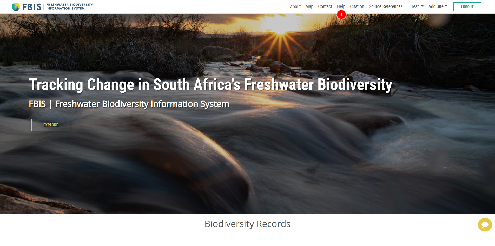

# Help

## Getting help using the FBIS platform

We are so pleased that users are using FBIS! The site offers a broad range of features, which are documented in the user [guide](../guide/index.md) and [manual](./index.md). For a quick start, users can explore the walk-through video of the platform. Lastly, although we strive to provide a seamless experience, users may occasionally encounter issues with the site. If such an issue arises, users are encouraged to report it on our issue tracker, and we will do our best to resolve it promptly!

## FBIS Testing site

For practicing the workflows for capturing data on FBIS, users should use the [FBIS Testing site](https://testing.healthyrivers.kartoza.com/). Here, users can add dummy data, as the data are overwritten with a mirror image of the FBIS Live (production) site every week. The same login works for both `FBIS Live` and `FBIS Testing`.

## User Manual

User can also checkout the [user manual](https://freshwaterbiodiversity.org/uploaded/documents/document/MmWwDIn-SCmrqt_lyQVbVw.pdf) for more information about the platform.

## instructional Videos

We have also created a series of instructional videos to help users get started with the platform.

* **Introduction to key FBIS components:**

    

* **Filtering data:**

    

* **Overview of spatial layers:**

    

* **Single and multi-site dashboards:**

    

* **Single and multi-site SASS dashboards:**

    

* **Taxon dashboard:**

    

*  **Exporting graphs and CSV files:**

    

* **Adding a site:**

    

* **Adding biodiversity data:**

    

* **Adding SASS data:**

    

*  **Preparing and adding water temperature time series data:**

    

* **Preparing an occurrence data upload file:**

    
