# Landing Page

Welcome to the `BIMS` landing page. The landing page is the entry point to user's data exploration journey. The landing page provides a user-friendly interface to access features like log in, register a new account, or learn more about the platform.

## Prior to Login

Upon initial interaction with the platform, users will be greeted by the landing page.

### Landing Page Header and Navigation Bar

[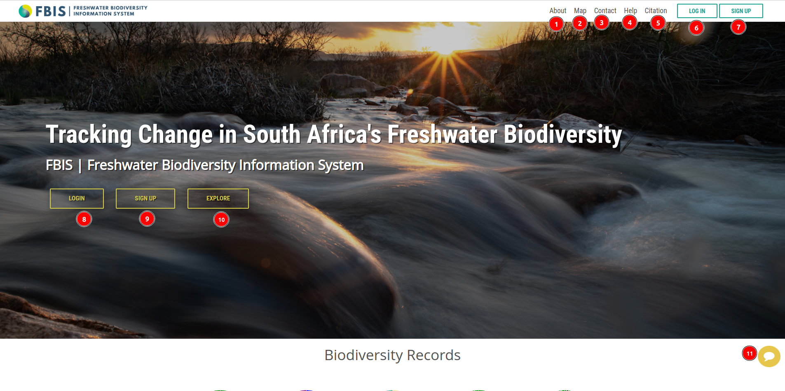](./img/landing-page-img-1.png)

1. **About:** The `ABOUT` navigation link navigates to the [about page](./about.md)

2. **Map:** The `MAP` navigation link navigates to the [map page](./map.md)

3. **Contact:** The `CONTACT` navigation link navigates to the [contact page](contact.md) where the BIMS team is ready to assist with any inquiries or issues.

4. **Help**: The `HELP` navigation link provides access to the [help page](help.md).

5. **Citation:** The `CITATION` navigation link provides access to the [citation page](citation.md).

6. **LOG IN:** The `LOGIN` button navigates to the [login form](./login.md) where registered users can securely access the platform using their credentials.

7. **SIGN UP:** The `SIGN UP` button navigates to the [sign up form](./sign-up.md) where users can create a new account.

8. **LOGIN**: The `LOGIN` button opens the [login form](./login.md) for registered users.

9. **SIGN UP**: The `SIGN UP` button opens the [sign up form](./sign-up.md) for new users.

10. **EXPLORE:** The `EXPLORE` button navigates to the [map page](./map.md) where user can explore the interactive map.

11. **Feedback:** The feedback button opens a form where users can share their feedback or report about the bug on platform. Logging in is required to submit the form.

    [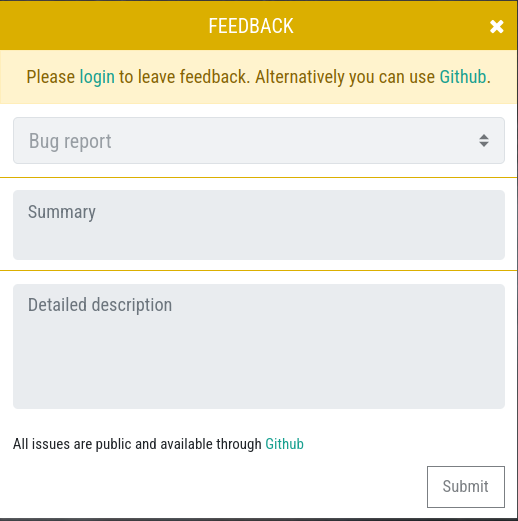](./img/landing-page-img-14.png)

### Biodiversity Records

The Biodiversity Records section provides an overview of the biodiversity data available on the platform. 

[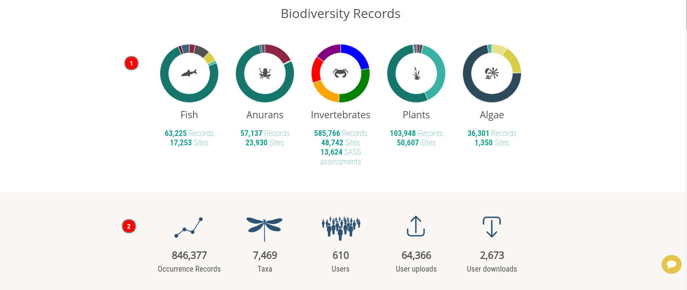](./img/landing-page-img-2.png)

1. This section displays the sample image of a species, the total number of records associated with it, and the total number of sites where it has been observed.

2. This section contains the user activities, such as the number of users who have viewed the species, the number of users who have downloaded the species data etc.

#### Meaning of different colours:

##### In case of Fish, Anurans, Invertebrates, Plants

- Teal: This colour signifies the lowest level of `concern`, typically indicating a species is stable and does not require immediate intervention. It represents a safe status with minimal risk.

- Crimson Red: This signifies the highest level of being `critically endangered`, indicating that the species is at an extremely high risk of extinction. Immediate and significant conservation or intervention efforts are required to prevent loss.

- Teal Blue: Teal blue is associated with the highest level of being `near-threatened`, meaning the species is facing potential threats and could become endangered without further action. It calls for monitoring and proactive conservation measures.

- Tropical Rainforest: This colour is used to denote a status of `not evaluated`. It indicates that no official assessment has been conducted yet regarding the species, so its conservation status remains unclear.

- Ruby Red: Ruby red signifies the highest level of being `endangered`. This colour indicates that the species is at serious risk of extinction in the near future unless action is taken. Conservation efforts are urgent and critical.

- Charcoal Gray: This colour represents the highest level of being `vulnerable`, meaning that the species faces a high degree of risk and is at significant threat, though not as immediate as being endangered. Vulnerable statuses often require ongoing protection efforts.

- Daffodil Yellow: Daffodil yellow is used to signify a level of `data deficiency`, indicating that there is insufficient information available to determine the full status or health of a species. Further research and data collection are needed for proper evaluation.

- Vivid Red: Vivid red signals a `poor level`, typically representing species that are in dire condition or exhibiting signs of severe deterioration. Immediate action is necessary to prevent further decline.

- Golden Yellow: Golden yellow represents a `fair level`, indicating that the species is somewhat stable, but there may still be areas that need attention or improvement to maintain its status.

- Green: Green signifies a `good level`, meaning the species is in a healthy, stable condition with no significant threats. This status is often ideal and indicates that everything is functioning well.

- Blue: Blue is used to represent a `natural level`, indicating that the species is at a baseline, typical state, not subject to significant human influence or immediate threats. It reflects a balanced, sustainable condition.

- Black: Black signifies a `rare level`, representing species that are infrequently encountered. This colour may indicate a state of scarcity or a unique status that demands special attention.

##### In case of Algae

- Dark Slate Blue: This colour signifies the level of `Bacillariophyta`, a group of microscopic algae commonly known as diatoms. These organisms are crucial for aquatic ecosystems as they contribute significantly to primary production and form the base of many food webs. They are characterised by their silica cell walls, which exhibit intricate patterns and designs.

- Tropical Rainforest: This colour represents the level of `Euglenophyta`, a diverse group of algae that can thrive in both freshwater and marine environments. Euglenophytes are known for their unique mixotrophic capabilities, allowing them to photosynthesise like plants or ingest food particles like animals when light is insufficient.

- Soft Aquamarine: This colour is associated with `Xanthophyta`. These algae are found in freshwater and terrestrial environments, and their yellow-green colouration comes from the dominance of carotenoids over chlorophyll. Xanthophytes are important for studying evolutionary adaptations in algae.

- Lemon Yellow: This colour signifies a member of the phylum `Cynophyta`, also known as cyanobacteria or blue-green algae. Despite their name, they are not true algae but prokaryotic organisms capable of photosynthesis. Cyanobacteria play a vital role in nitrogen fixation and have significantly shaped earth’s atmosphere and ecosystems over billions of years.

- Daffodil Yellow: This colour signifies a member of the phylum `Chlorophyta`, commonly referred to as green algae. Chlorophytes are photosynthetic organisms that inhabit a wide range of environments, from freshwater to marine habitats. They are closely related to land plants and are considered key to understanding plant evolution. Chlorophytes are also crucial in aquatic food chains and contribute to oxygen production.

### Platform Details

[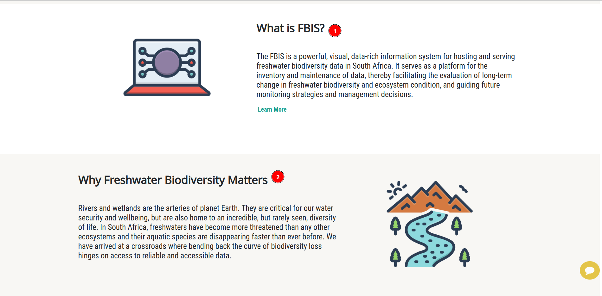](./img/landing-page-img-3.png)

1. **What is FBIS:** The FBIS is a powerful, visual, data-rich information system for hosting and serving freshwater biodiversity data in South Africa. It serves as a platform for the inventory and maintenance of data, thereby facilitating the evaluation of long-term change in freshwater biodiversity and ecosystem condition, and guiding future monitoring strategies and management decisions. Users can learn more about the platform by clicking [here](https://www.frcsa.org.za/our-work/freshwater-biodiversity-information-system-fbis/).

2. **Why Freshwater Biodiversity Matters:** Rivers and wetlands are the arteries of planet Earth. They are critical for our water security and wellbeing, but are also home to an incredible, but rarely seen, diversity of life. In South Africa, freshwaters have become more threatened than any other ecosystems and their aquatic species are disappearing faster than ever before. We have arrived at a crossroads where bending back the curve of biodiversity loss hinges on access to reliable and accessible data.  

[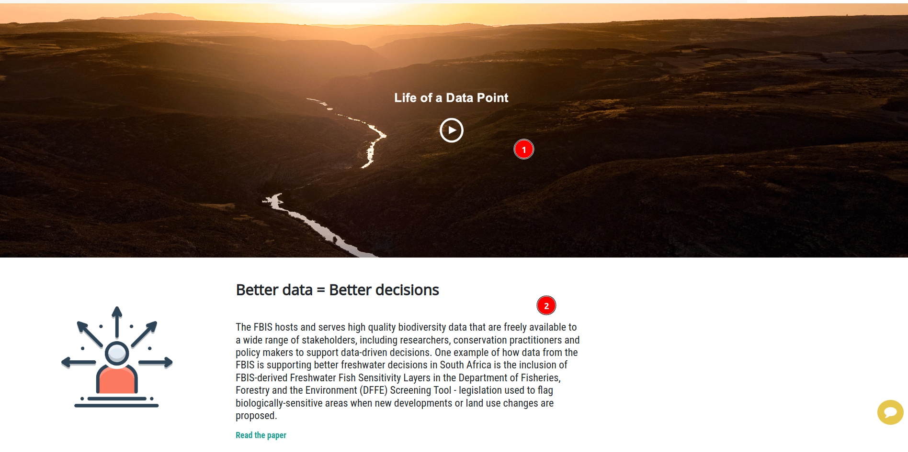](./img/landing-page-img-4.png)

1. **Life of a Data Point:** [Video](https://www.youtube.com/watch?v=YQkAJSDaoK8) explaining the life of a data point from collection to publication.

2. **Better data = Better decisions:** The FBIS hosts and serves high quality biodiversity data that are freely available to a wide range of stakeholders, including researchers, conservation practitioners and policy makers to support data-driven decisions. One example of how data from the FBIS is supporting better freshwater decisions in South Africa is the inclusion of FBIS-derived Freshwater Fish Sensitivity Layers in the Department of Fisheries, Forestry and the Environment (DFFE) Screening Tool - legislation used to flag biologically-sensitive areas when new developments or land use changes are proposed. Users can also read the papers by clicking [here](https://www.frontiersin.org/journals/environmental-science/articles/10.3389/fenvs.2023.1122223/full)

### Community Practice

[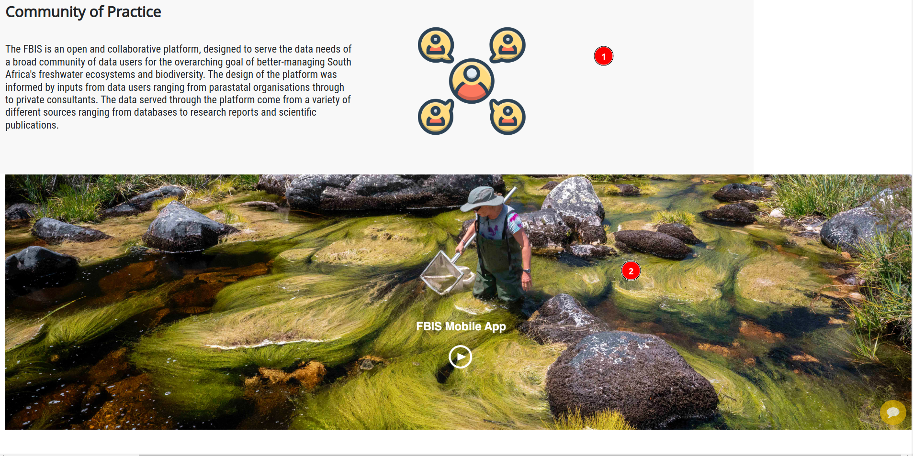](./img/landing-page-img-5.png)

1. The FBIS is an open and collaborative platform, designed to serve the data needs of a broad community of data users for the overarching goal of better-managing South Africa's freshwater ecosystems and biodiversity. The design of the platform was informed by inputs from data users ranging from parastatal organisations through to private consultants. The data served through the platform come from a variety of different sources ranging from databases to research reports and scientific publications.

2. **FBIS Mobile App:** A [video](https://www.youtube.com/watch?v=T2yADWef0sw) explaining the FBIS mobile app and its features.

### FBIS Mobile App

[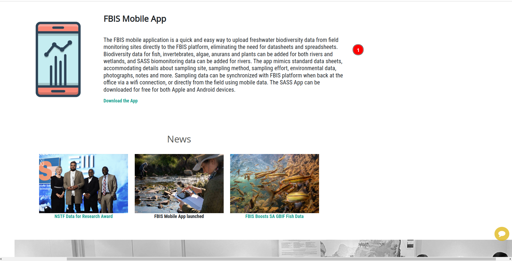](./img/landing-page-img-6.png)

1. **FBIS Mobile App:** The FBIS mobile application is a quick and easy way to upload freshwater biodiversity data from field monitoring sites directly to the FBIS platform, eliminating the need for datasheets and spreadsheets. Biodiversity data for fish, invertebrates, algae, anurans and plants can be added for both rivers and wetlands, and SASS biomonitoring data can be added for rivers. The app mimics standard data sheets, accommodating details about sampling site, sampling method, sampling effort, environmental data, photographs, notes and more. Sampling data can be synchronized with FBIS platform when back at the office via a wifi connection, or directly from the field using mobile data. The SASS App can be downloaded for free for both Apple and Android devices.

### News 

The News section provides updates on the latest developments and events related to the platform.

[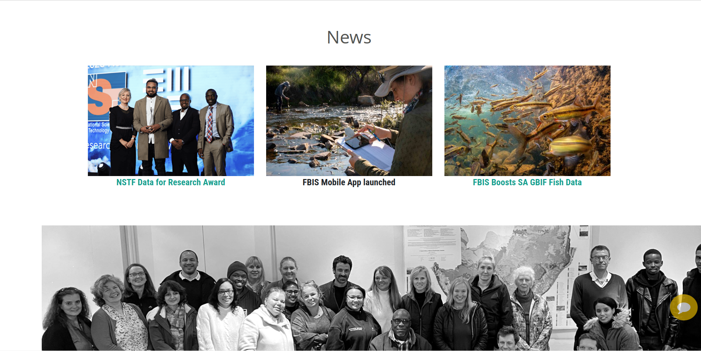](./img/landing-page-img-7.png)

### Biodiversity Team

### Partners 

FBIS collaborates with various organisations to advance its platform and achieve its objectives.

[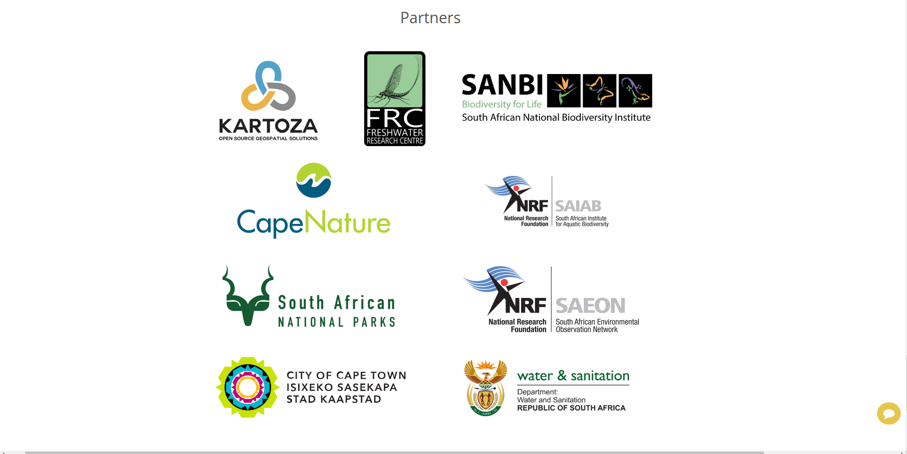](./img/landing-page-img-9.png)

### Founders

[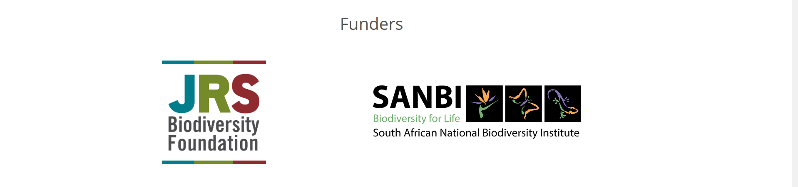](./img/landing-page-img-10.png)

### Footer Section

[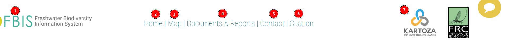](./img/landing-page-img-11.png)

1. **FBIS Logo:** This logo navigates to the [home page](./landing-page.md)

2. **Home:** This link navigates to the [home page](./landing-page.md).

3. **Map:** The `Map` link navigates to the [map page](./map.md).

4. **Documents & Reports:** `Documents & Reports` link navigates to the [Source References page](./source-reference-page.md).

5. **Contact:** The `CONTACT` navigation link navigates to the [contact page](contact.md) where the BIMS team is ready to assist with any inquiries or issues.

6. **Citation:** The `Citation` link navigates to the [citation page](./citation.md).

7. **Kartoza Logo:** This logo navigates to the [Kartoza website](https://www.kartoza.com/).

## Landing Page Once Logged In

Once the user has logged in to the FBIS platform the landing page updates. In the header, there are new navigation links to features of the site that users with credentials have access to, their user profile, and the Quick links provide access to site features that users will need frequently.

After logging in, the users will see the following window with a notice.

[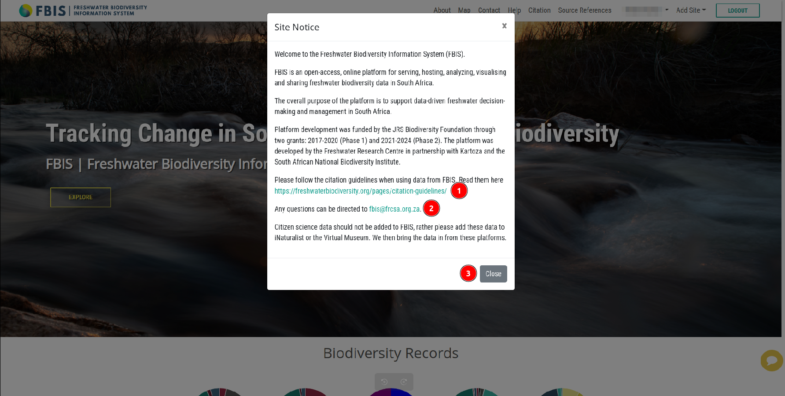](./img/landing-page-img-15.png)

1. **Citation guideline:** Link to citation guidelines.

2. **FBIS link:** Users can submit their inquiries here.

3. **Close:** Close the notice.

[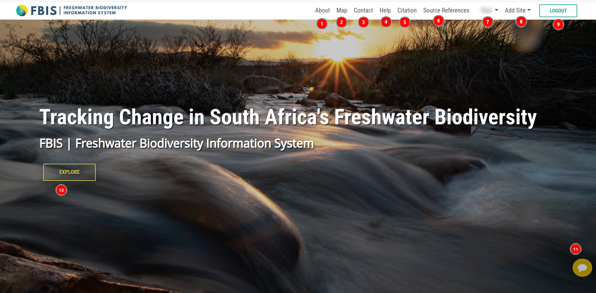](./img/landing-page-img-12.png)

1. **About:** The `ABOUT` navigation link navigates to the [about page](./about.md)

2. **Map:** The `MAP` navigation link navigates to the [map page](./map.md)

3. **Contact:** The `CONTACT` navigation link navigates to the [contact page](contact.md) where the BIMS team is ready to assist with any inquiries or issues.

4. **Help**: The `HELP` navigation link provides access to the [help page](help.md).

5. **Citation:** The `CITATION` navigation link provides access to the [citation page](citation.md).

6. **Source References:** The `Source References` link navigates to the [source references page](./source-reference-page.md).

7. **User Profile:** The `User Profile` link navigates to the [user profile page](./user-profile.md).

8. **Add Site:** The `Add Site` link navigates to the [add site page](./login.md) where users can add new sites to the map.

9. **LOGOUT:** The `LOGOUT` button logs the user out of the platform.

10. **EXPLORE:** This link navigates to the [map page](./map.md) where users can access the interactive map.

11. **Feedback:** The feedback button opens a form where users can share their feedback or report about the bug on platform.

    [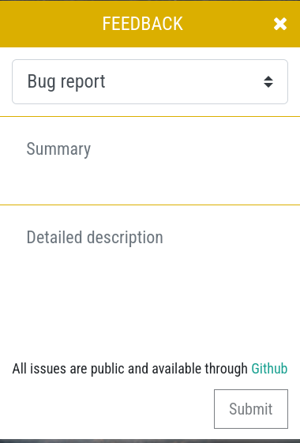](./img/landing-page-img-13.png)
