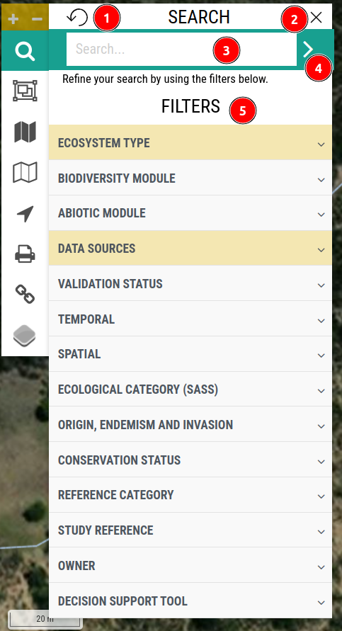
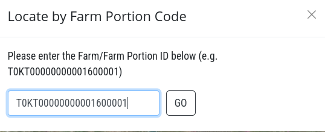
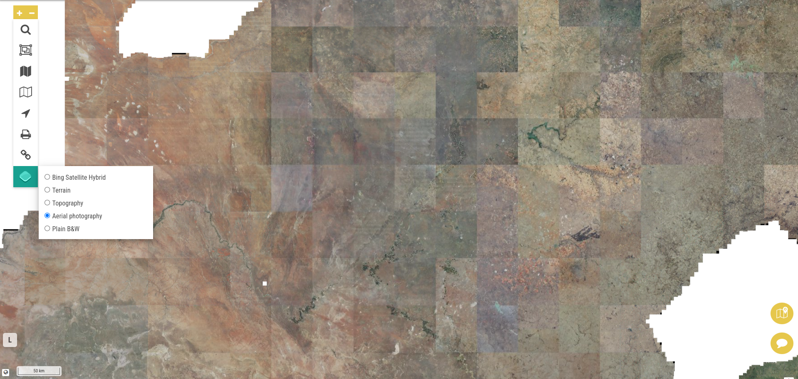

# Map Page

1. **Map:** Users can access the map page by clicking on this button.

> Note: To access all functionalities of the map, users need to be logged in.

1. **Tool Bar:** The tool bar allows users to access the various functionalities of the map.

2. **Sites:** Users can view the meanings of different colours on the map here.

3. ** Icon:** By clicking this icon, users can display the cursor's exact coordinates on the map, which will appear to the right of the icon for precise location identification.

    

4. **Range:** This shows the range of the map displayed, measured in kilometres.

5. **Map:** The map itself.

6. **WETLAND MAP FEEDBACK:** Users can provide feedback on the map by clicking on this button.

    

    1 **Location Indicator:** Users can select the location they want to provide feedback on by clicking on the map.

    2 **X:** Users can close the feedback form by clicking on this button.

    3 **Longitude and Latitude:** The exact coordinates of the location selected by the user will be displayed here.

    4 **Wetland not mapped:** Users are required to provide a brief summary about the issue here.

    5 **Dropdown menu:** Users are required to select the context related to their issue from the drop-down menu.

    6 **User name:** This contains the name of the current logged in user.

    7 **Detailed description:** Users are required to provide the detailed description of the issue here.

    8 **Submit:** After filling in all the details users will be able to submit the feedback form.

    

    * Users will receive this window after clicking on the submit button.

    

    * Upon the successful submission of the form, users will receive this alert.

    * **OK:** Users can close the alert by clicking on this button.

7. **SEND FEEDBACK:** Users can use this button to send feedback. For more information click [here](./feedback-form.md).

## Access Tool Bar

* **:** Users can zoom in and out of the map by clicking on this button.

* **:** Users can search for a specific location by clicking on this button.

    

    1 **Reset button:** Users can reset the search results by clicking on this button.

    2 **X:** Users can close the search form by clicking on this button.

    3 **Search bar:** Users can enter a keyword related to the location they wish to search for in this bar.

    4 **:** Users can apply the search results by clicking on this button.

    * For example, if a user search for `koop` in the search bar, the search results will be displayed as follows:

        

        1 **Records:** Displays the searched keyword along with the names of the available records.

        2 **Sort by:** Users can sort the search results by selecting options from this drop-down menu.

        3 **SITES:** These are the available sites that match the search criteria. Clicking on this will display the list of sites, and the user can click on any site to view its details.

        

        **1 Q(KOOP-00001):** Displays the code of the site.

        **2 Site Details:** The corresponding details of the site are displayed here, including ecosystem type, site code, description, coordinates, and ecoregion level.

        **3 Biodiversity Data:** The biodiversity data of the site is displayed here.

        

        - **Add:** This button allows users to add new biodiversity data to the site for the corresponding species. This will redirect the users to the new page where they can add the data. For more information on how to add the biodiversity data click [here](./add-biodiversity-data.md).

        - **Biodiversity Dashboard:** This button provides users with access to the species dashboard for detailed insights. For more information about how to access the dashboard click [here](./biodiversity-dashboard.md).

        - **SASS Dashboard:** Allows users to access the sass dashboard.

        - **Pesticide Dashboard:** Allows users to access the pesticide dashboard. For more information about how to access the pesticide dashboard click [here](./pesticide-dashboard.md).

        **4 Climate data:** The climate data of the site is displayed here.

        **5 Monthly Average Temperature:** The monthly average temperature of the site is displayed here.

        4 **TAXA:** This are the available taxa that match the search criteria. By clicking on any result will open its details.

        

5. **Filter:** Users can filter the search results by selecting options from this drop-down menu. Various categories are available, such as `Biodiversity Module`, `Abiotic Module`, `Data Sources`, and more. 

    * For example: We are filtering the search results by selecting `Validated` from the `Validation Status` drop-down menu.

    - 

        1 **VALIDATION STATUS:** Drop down menu to filter the search results by validation status.

        2 **APPLY:** Button to apply the filter.

        3 **CLEAR:** Button to clear the filter.

        4 **SITES:** The available sites that match the search criteria and filter are displayed here.

        5 **TAXA:** The available taxas that match the search criteria and filter are displayed here.

* **:** Sites may also be selected by using `Lasso Control`. This feature allows the user to draw a polygon around specific sites to include in dashboards. 

    

    - **X:** Users can use this button to close the form.

    - **Draw a Polygon:** This option allows users to draw polygon on the site.

        - Click on this option to begin drawing the polygon based on the user’s requirements. The user can pin points on the map to outline the polygon, and upon completion, click on the last point to finalise and exit the editing mode.

            

    - **Update Search:** By clicking `Update Search` the user will see the search results for all the sites in the polygon. 

    - **Save Polygon:** After drawing the polygon on the map click on this button to save that polygon.

        

        - **Close:** This button allows users to close the form.

        - **Save:** This button allows users to save the polygon.

            

            After saving it user will receive the notification message that `User boundary added.`

    - **Upload Polygon:** This button allows users to upload a polygon.

    - **Load Saved Polygon:** This button allows users to load a saved polygon.

        

        - **Close:** This button users to close the current process.

        - **Delete:**This button enables users to delete a polygon. First, select the polygon to be deleted, and then click on the delete button.

        - **Load:** This button allows users to load an existing saved polygon. First, select the polygon to be loaded, and then click on this button.

    - **Clear Polygon:** This button allows users to clear the polygon.

* **:** Allows users to select layer to display on the map.

    - Before applying any layer:

        

    - After applying `Geomorphological Zones` layer:

        

    - **Adjust Visibility:** Users can use the below `Slider` to adjust the visibility of the layer on map.

* **:**  Allows users to select the third party layers. To apply the third party layer on the map users are required to check the box.

    > Note: This process may took some time to load the data.

    - Before applying any third party layer:

        

    - After applying third party layer:

        

* **:** Allows users to locate the location on the map.

    

    - **Locate by Coordinate:** This option allows users to locate the location on the map by entering the location coordinates.

        >Note: Please enter the decimal latitude (negative degrees South) and longitude (positive degrees East) coordinates of your area of interest below! `e.g. for Cape Town being -33.xxx 19.xxx`

        

        - **Go:** After entering the coordinates click on the the `Go` button to locate the location on the map.

            

    - **Locate by Farm Portion Code:** This option allows users to locate the location on the map by entering the farm portion code.

        

       - **Go:** After entering the farm portion code click on the the `Go` button to locate the farm location on the map.

        

        >Note: Please enter the Farm/Farm Portion ID below (`e.g. T0KT00000000001600001`)

* **:** This option allows users to print the map.

    

    1 **X:** Users can close the window by clicking on this icon.

    2 **Download the map as:** This option allows users to select the map format for download.

    3 **Download:** After selecting the map format click on the `Download` button to download the map. This process may take some time to complete.
    
    

    This is the downloaded map.

    

* **:** This option allows to to copy the link. To copy the link just click on this icon once.

    >Note: Users can copy the link only when a filter is applied.

* **:** This button allows users to `Change Basemap`.

    

    These are the available options. Users are required to click on the radio button to the corresponding map to apply it.

    - **Bing Satellite Hybrid:** A `Bing Satellite Hybrid` map combines high-resolution satellite imagery with labelled roads, landmarks, and other map details.

        

    - **Terrain:** A `Terrain` map displays physical features of the land, such as elevations, mountains, valleys, and contours, often with shaded relief for clarity.

        

    - **Topography:** Topography refers to the detailed mapping and representation of the Earth's surface features, including natural formations like mountains, valleys, and plains, as well as human-made structures, depicted with elevation, contour lines, and relief.

        

    - **Aerial Photography:** Aerial photography involves capturing images of the Earth's surface from an elevated position, typically using aircraft, drones, or satellites, to provide a bird's-eye view for mapping, surveying, or analysis.

        

    - **Plain B/W:** Plain B/W (Black and White) refers to a simple, monochromatic map or image that uses only black and white colours, often for clarity, contrast, or minimalist design.

        
