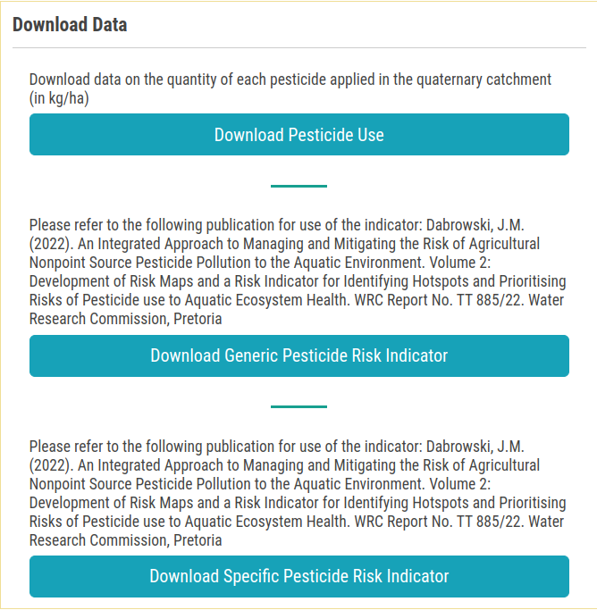

# Pasticide Dashboard

1. **X:** Allows users to close the current page.

2. **Map:** This interactive map displays the site's location.

    * **➕ and ➖:** Allows users to zoom in and out of the map.

    * **:** By clicking on this icon, users can download the map.

        

        - **Purpose:** Users can select their purpose for downloading the map from this drop-down menu, with options such as scientific articles, reports, theses, or other predefined categories. Custom purposes cannot be added, as users can only choose from the available options.    

        - **Notes:** Adding additional notes to accompany the downloaded map is optional but available for users who wish to include them.

        - **Download:** Allows users to download the map with the selected purpose and notes.

        - **Close:** Users can use this button close the process.

3. **Potential Risk:** This section provides information about the potential risks associated with the site, presented in a graphical representation format, allowing for a clearer and more intuitive understanding of the risk factors.

    * **:** Users can access the menu by clicking on this icon.

        

        - **View in full screen:** Users can view the potential risks in full screen mode.

        - **Print chart:** Users can print the potential risks chart.

            

        - **Download:** Users can download the potential risks chart in the various format such as PDF, PNG, SVG and JPEG.

        - **Download CSV:** Users can download the potential risks chart in CSV format.

        - **Download XLS:** Users can download the potential risks chart in XLS format.

        - **View data table:** Users can view the data table of the potential risks chart.

            

4. **Overview:** This section provides an overview of the site.

    **:** Allows users to download the overview.

    * **Site details:** This section offers detailed information about the site, including its unique code, geographical location, and other pertinent attributes necessary for comprehensive understanding.

        

    * **Ecosystem Characteristics:** This section offers detailed insights into the ecosystem characteristics of the site, including its unique type, wetland name, and environmental significance.

        

    * **Province, Ecoregion and Water Source Area:** This section provides comprehensive information about the site, including its province, ecoregion, and associated water source area, highlighting its geographical and ecological context.

        

    * **Catchment:** This section provides information about the catchment of the site.

        

    * **Climate, Vegetation and Soils:** This section offers detailed information about the site's climate, vegetation, and soil characteristics, highlighting the environmental factors and natural features that define the area.

        

    * **Protected Areas:** This section provides information about the protected areas of the site.

        

    * **Management Area:** This section offers detailed insights into the site's management area, including its water management area, river management units, and relevant management practices.

        

    * **National Biodiversity Assessment:** This section provides detailed information about the site's national biodiversity assessment, including its ecological importance, conservation priorities, and biodiversity status within a national context.

        

    * **Species and Occurrences:** This section provides information about the species and their occurrences on the site.

        
    
5. **Top 10 Pesticides:** This section provides information about the top 10 pesticides available on the site.

    * **:** Allows users to download the top 10 pesticides list.

        

        - **Purpose:** Users can select their purpose for downloading the data from this drop-down menu, with options such as scientific articles, reports, theses, or other predefined categories. Custom purposes cannot be added, as users can only choose from the available options.    

        - **Notes:** Adding additional notes to accompany the downloaded data is optional but available for users who wish to include them.

        - **Download:** Allows users to download the data with the selected purpose and notes. This is how the downloaded will look like.

            

        - **Close:** Users can use this button close the process.

* **Download Pesticide Use:** Download comprehensive data on the quantity of each pesticide applied within the quaternary catchment area, with the application rates expressed in kilograms per hectare (kg/ha), providing a detailed view of pesticide usage across the region.

    

    - **Purpose:** Users can select their purpose for downloading the data from this drop-down menu, with options such as scientific articles, reports, theses, or other predefined categories. Custom purposes cannot be added, as users can only choose from the available options.    

    - **Notes:** Adding additional notes to accompany the downloaded data is optional but available for users who wish to include them.

    - **Format:** Users can select the format in which they want to download the data, with options including CSV and Excel.

    - **Download:** Allows users to download the data with the selected purpose and notes. This is how the downloaded will look like.

    - **Close:** Users can use this button cancel the process.

* The process will remains the same for the `Download Generic Pesticide Risk Indicator` and the `Download Specific Pesticide Risk Indicator`.
